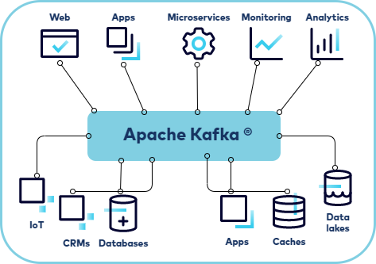
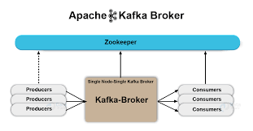

# Introduction to Apache Kafka

**Apache Kafka** adalah platform distributed event streaming yang **digunakan untuk membangun real-time data pipeline dan aplikasi streaming**. Kafka dirancang untuk menangani volume data yang besar secara skalabel dan tahan terhadap kegagalan (fault-tolerant), sehingga sangat cocok untuk use case seperti analitik real-time, ingest data, dan arsitektur berbasis event (event-driven architecture).

Pada intinya, **Kafka merupakan sistem messaging publish-subscribe yang terdistribusi**. Data ditulis ke dalam topic Kafka oleh producer dan dikonsumsi dari topic tersebut oleh consumer. Topic Kafka dapat dipartisi sehingga memungkinkan pemrosesan data secara paralel, dan juga dapat direplikasi ke beberapa broker untuk menjamin keandalan sistem.

Dengan Kafka, kamu juga mendapatkan**command-line tools** untuk tugas manajemen dan administrasi, serta Java dan Scala API untuk membangun solusi event streaming sesuai dengan kebutuhan skenario aplikasi kamu.

# Events and event streaming

Untuk memahami distributed event streaming secara lebih mendalam, kamu perlu memahami terlebih dahulu bahwa **event adalah sebuah catatan yang menandakan bahwa “sesuatu telah terjadi” di dunia nyata atau dalam bisnis kamu**. Sebagai contoh, dalam sistem ride-share, kamu mungkin akan menemukan event seperti berikut:

```
Event key: “Alice”
Event value: “Permintaan perjalanan dari lokasi kantor”
Event timestamp: “25 Juni 2020 pukul 14:06”
```


**Data event menjelaskan apa yang terjadi, kapan terjadi, dan siapa yang terlibat**. **Event streaming adalah praktik menangkap event-event seperti contoh di atas secara real-time dari berbagai sumber, seperti database, sensor, perangkat mobile, layanan cloud, dan aplikasi perangkat lunak.**

Sebuah platform event streaming menangkap event secara berurutan dan menyimpan aliran event tersebut secara permanen (durable) agar dapat diproses, dimanipulasi, dan ditindaklanjuti secara real-time, atau diambil kembali di kemudian hari. Selain itu, aliran event dapat diarahkan ke berbagai teknologi tujuan sesuai kebutuhan. **Event streaming memastikan aliran data yang berkelanjutan dan interpretasi data yang tepat, sehingga informasi yang benar berada di tempat yang tepat, pada waktu yang tepat**.

Untuk mewujudkan hal tersebut, Kafka dijalankan sebagai cluster pada satu atau lebih server yang dapat tersebar di berbagai data center, serta menyediakan fungsionalitasnya secara terdistribusi, sangat skalabel, elastis, tahan terhadap kegagalan, dan aman. Selain itu, Kafka dapat dideploy di bare-metal hardware, virtual machine, container, lingkungan on-premises, maupun cloud.

# Use Case (Contoh Penggunaan)

Event streaming digunakan untuk berbagai macam kebutuhan di banyak industri dan organisasi. Berikut beberapa contohnya:

1. **Sebagai sistem messaging**
Kafka dapat digunakan untuk memproses pembayaran dan transaksi keuangan secara real-time, seperti pada bursa saham, bank, dan perusahaan asuransi.

2. **Pelacakan aktivitas (activity tracking)**
Kafka dapat digunakan untuk melacak dan memantau mobil, truk, armada, dan pengiriman secara real-time, misalnya pada layanan taksi, industri logistik, dan otomotif.

3. **Mengumpulkan data metrik**
Kafka dapat digunakan untuk menangkap dan menganalisis data sensor secara terus-menerus dari perangkat IoT atau peralatan lainnya, seperti di pabrik dan pembangkit listrik tenaga angin.

4. **Stream processing**
Kafka dapat digunakan untuk mengumpulkan dan merespons interaksi serta pesanan pelanggan secara real-time, misalnya di industri ritel, perhotelan, perjalanan, dan aplikasi mobile.

5. **Memisahkan sistem (decoupling system)**
Kafka dapat digunakan untuk menghubungkan, menyimpan, dan menyediakan data yang dihasilkan oleh berbagai divisi dalam satu perusahaan, sehingga sistem menjadi lebih fleksibel dan tidak saling bergantung langsung.

6. **Integrasi dengan teknologi big data lainnya**
Kafka dapat diintegrasikan dengan teknologi big data seperti Hadoop untuk kebutuhan analisis data skala besar.

# Terminology

## Broker



**Broker** adalah server pada lapisan penyimpanan Kafka yang bertugas menyimpan aliran event (event streams) dari satu atau lebih sumber. **Sebuah cluster Kafka biasanya terdiri dari beberapa broker**. Setiap broker dalam sebuah cluster juga berfungsi sebagai **bootstrap server**, yang berarti jika kamu dapat terhubung ke satu broker dalam cluster, maka kamu otomatis dapat terhubung ke seluruh broker yang ada di cluster tersebut.

## Topics

Cluster Kafka mengatur dan **menyimpan aliran event secara permanen (durable) dalam kategori yang disebut topic**, yang merupakan **unit organisasi paling dasar** dalam Kafka. Sebuah topic adalah **log event**, mirip seperti **folder** dalam sistem file, di mana **event-event di dalamnya berperan seperti file-file** yang tersimpan di folder tersebut.

Sebuah topic memiliki karakteristik sebagai berikut:

1. **Topic bersifat append-only**: ketika event baru ditulis ke dalam topic, pesan tersebut akan ditambahkan di bagian akhir log.
2. **Event bersifat immutable**: artinya event tidak dapat diubah setelah ditulis.
3. Consumer membaca log berdasarkan offset dan kemudian membaca event secara berurutan.
4. **Topic di Kafka selalu bersifat multi-producer dan multi-subscriber**: sebuah topic dapat memiliki nol, satu, atau banyak producer yang menulis event, serta nol, satu, atau banyak consumer yang berlangganan topic tersebut.
5. **Topic tidak dapat di-query secara langsung**, tetapi event di dalam topic dapat dibaca berulang kali sesuai kebutuhan. Berbeda dengan sistem messaging lainnya, event tidak dihapus setelah dikonsumsi. Sebagai gantinya, topic dapat dikonfigurasi agar data kedaluwarsa setelah mencapai usia tertentu atau ukuran tertentu.
6. **Performa Kafka relatif konstan terhadap ukuran data**, sehingga menyimpan data dalam jangka waktu lama tidak berdampak signifikan terhadap performa.
7. **Kafka juga menyediakan berbagai CLI tools untuk mengelola cluster**, broker, dan topic, serta Admin Client API yang memungkinkan kamu membangun tools administrasi sendiri.