# Quorum

Quorum itu konsep jumlah minimum anggota yang harus hadir atau berpartisipasi supaya keputusan atau operasi dianggap sah. 

Di ZooKeeper, quorum adalah mayoritas node (server) yang harus aktif dan saling berkomunikasi supaya:

- leader bisa dipilih
- write (perubahan data) bisa di-commit
- state cluster dianggap valid & konsisten

---

# Langkah-langkah pembuatan 3 zookeeper

## 1. Matikan semua service confluent

command matikan semua service cp:

```
sudo systemctl stop confluent-control-center
sudo systemctl stop confluent-kafka-rest
sudo systemctl stop confluent-ksqldb
sudo systemctl stop confluent-kafka-connect
sudo systemctl stop confluent-schema-registry
sudo systemctl stop confluent-server
sudo systemctl stop confluent-zookeeper
```

cek unit confluent:

`sudo systemctl list-units | grep confluent`

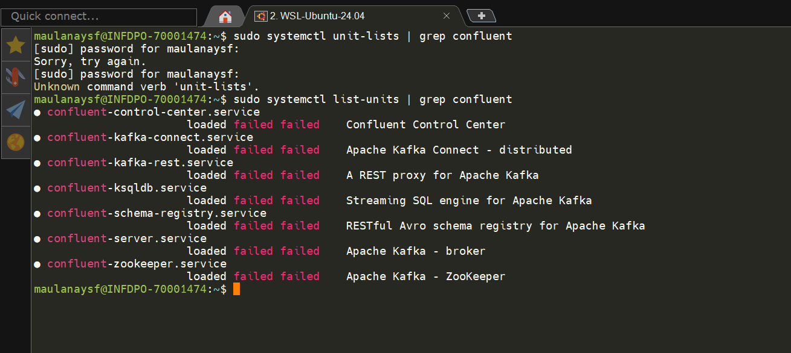

## 2. Setup 3ZK directory + myid + configs

### buat 3 folder data untuk zookeeper
```
sudo mkdir -p /var/lib/zookeeper{1,2,3}
sudo chown cp-kafka:confluent /var/lib/zookeeper{1,2,3}
```

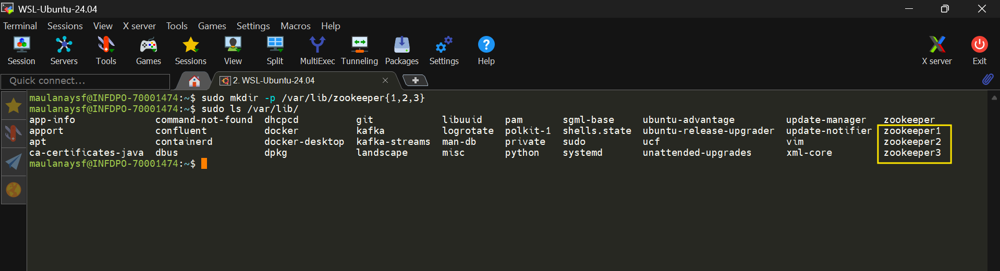

### ubah izin folder tersebut ke user:grup cp-kafka:confluent

```
sudo chown cp-kafka:confluent /var/lib/zookeeper{1,2,3}
```

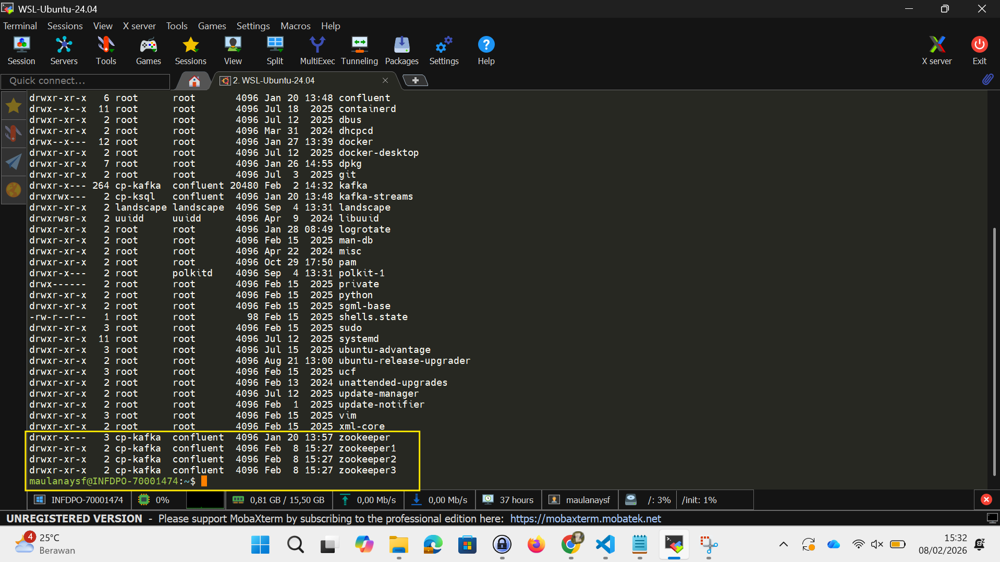

### buat file myid

myid adalah file yang digunakan zookeeper untuk identitas node.

```
echo "1" | sudo tee /var/lib/zookeeper1/myid
echo "2" | sudo tee /var/lib/zookeeper2/myid
echo "3" | sudo tee /var/lib/zookeeper3/myid
```

### buat 3 file config zookeeper

```
sudo tee /etc/kafka/zookeeper1.properties << 'EOF'
dataDir=/var/lib/zookeeper1
clientPort=2181
tickTime=2000
initLimit=5
syncLimit=2
autopurge.snapRetainCount=3
autopurge.purgeInterval=1
server.1=localhost:2888:3888
server.2=localhost:2889:3889
server.3=localhost:2890:3890
EOF

sudo tee /etc/kafka/zookeeper2.properties << 'EOF'
dataDir=/var/lib/zookeeper2
clientPort=2182
tickTime=2000
initLimit=5
syncLimit=2
autopurge.snapRetainCount=3
autopurge.purgeInterval=1
server.1=localhost:2888:3888
server.2=localhost:2889:3889
server.3=localhost:2890:3890
EOF

sudo tee /etc/kafka/zookeeper3.properties << 'EOF'
dataDir=/var/lib/zookeeper3
clientPort=2183
tickTime=2000
initLimit=5
syncLimit=2
autopurge.snapRetainCount=3
autopurge.purgeInterval=1
server.1=localhost:2888:3888
server.2=localhost:2889:3889
server.3=localhost:2890:3890
EOF
```

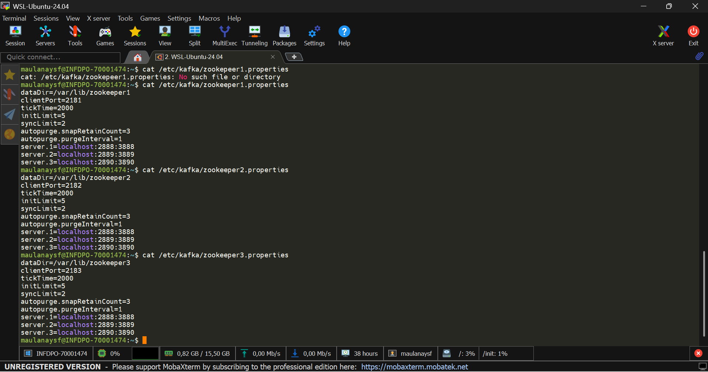

### remove metadata broker lama

`sudo rm -rf /var/lib/kafka*`

### buat folder metadata baru (broker kafka)

`sudo mkdir -p /var/lib/kafka`
`sudo chown -R cp-kafka:confluent /var/lib/kafka`

### buat folder metadata baru (ksqldb)

`sudo mkdir -p /var/lib/kafka-streams`
`sudo chown -R cp-kafka:confluent /var/lib/kafka-streams`
`sudo chmod 755 /var/lib/kafka-streams`

### update kafka config (zookeeper.connect string)

```
sudo nano /etc/kafka/server.properties

cari config zookeeper.connect, lalu tambahkan ip:port zookeeper yang sudah disetting
```

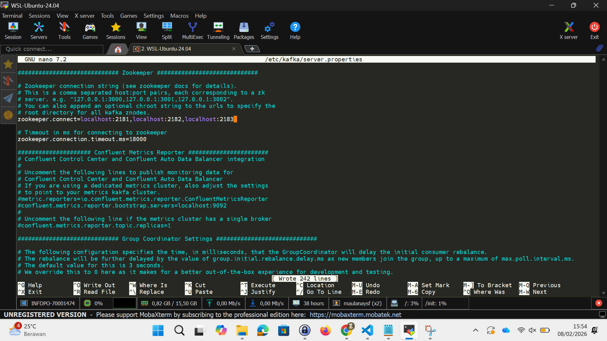

### jalankan service zookeeper 

buka 3 terminal berbeda dan jalankan zookeper

```
sudo /usr/bin/zookeeper-server-start /etc/kafka/zookeeper1.properties
sudo /usr/bin/zookeeper-server-start /etc/kafka/zookeeper2.properties
sudo /usr/bin/zookeeper-server-start /etc/kafka/zookeeper3.properties
```

ZK1:

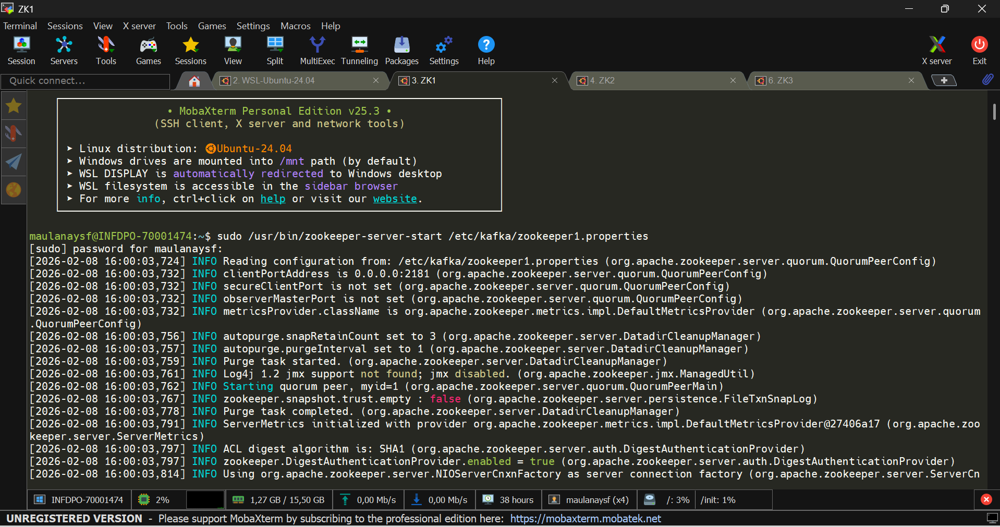

ZK2:

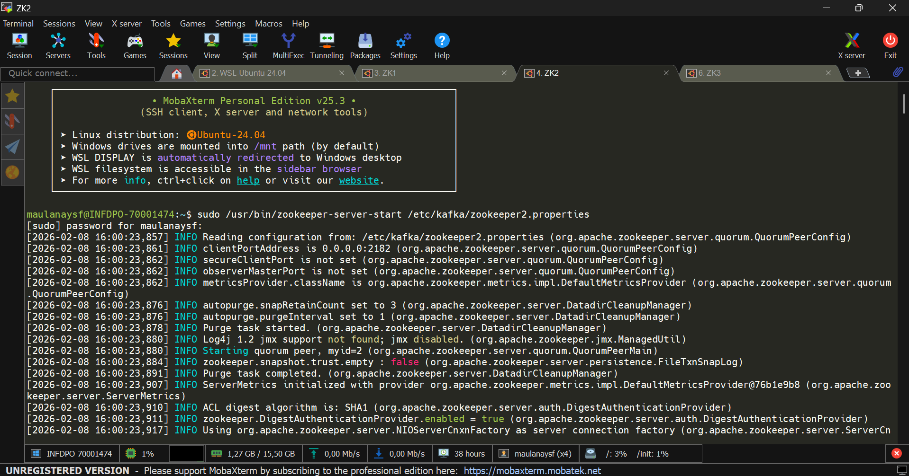

ZK3:

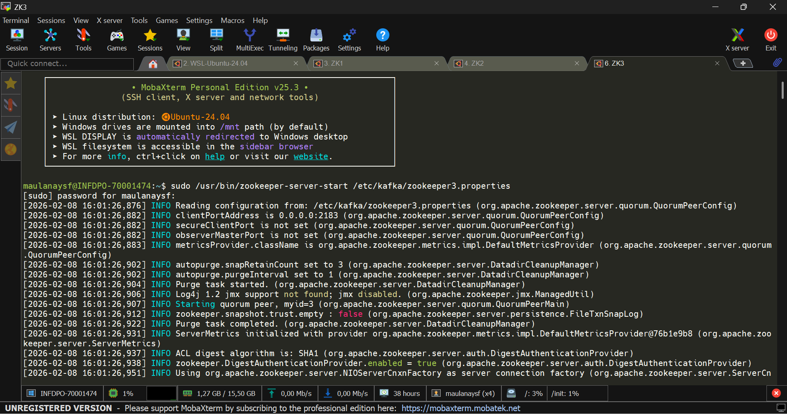

### cek zk start dan listen

```
sudo netstat -tlnp | grep -E "2181|2182|2183"
```

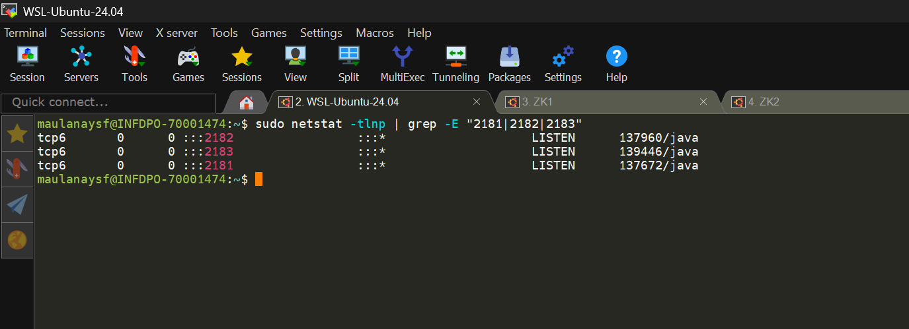

### start kafka broker

`sudo systemctl start confluent-server`

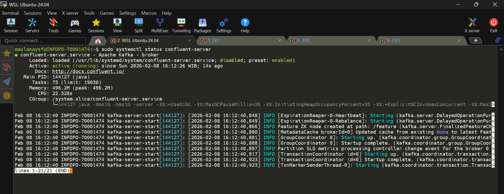

### jalankan service cp yang lain

```
sudo systemctl start confluent-schema-registry
sudo systemctl start confluent-kafka-connect
sudo systemctl start confluent-ksqldb
sudo systemctl start confluent-kafka-rest
sudo systemctl start confluent-control-center
```

### akses dashboard c3

localhost:9021

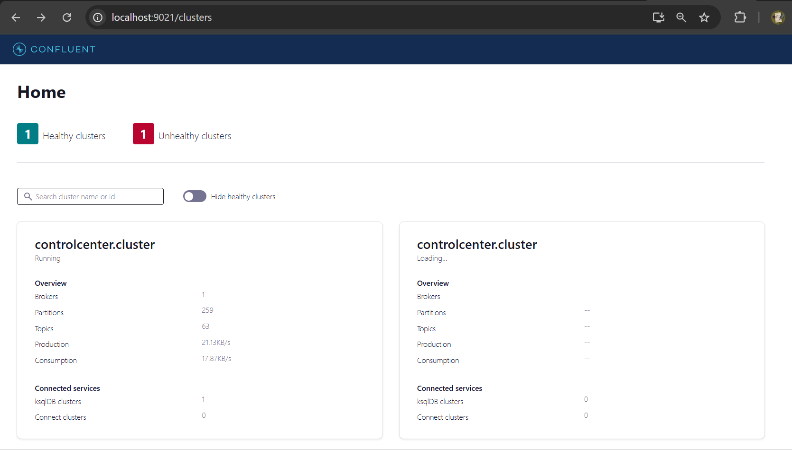


---

### troubleshoot

### ksqldb service tidak mau jalan

setelah dicek menggunakan command
`grep -E "state.dir|log.dirs" /etc/ksqldb/ksql-server.properties
`

tidak ditemukan folder **/var/lib/kafka-stream** hal ini karena sebelum dijalankan semua metadata lama dihapus terlebih dahulu.