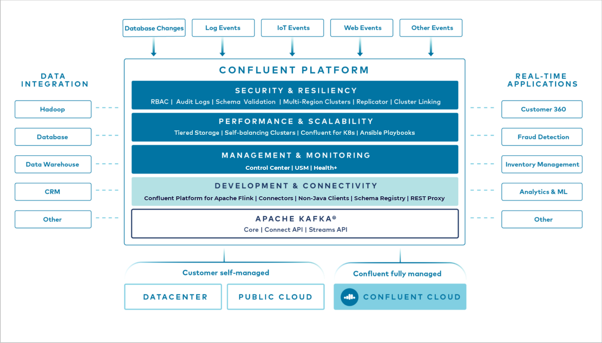

# Pengenalan Confluent Platfom

Confluent Platform adalah **platform streaming** berskala penuh yang memungkinkan kamu mengakses, menyimpan, dan mengelola data sebagai aliran (stream) yang berjalan terus-menerus dan real-time dengan mudah. **Platform ini dibangun oleh pencipta / co-creator asli dari Apache Kafka®**, sehingga Confluent Platform merupakan platform siap enterprise yang melengkapi Kafka dengan berbagai kemampuan lanjutan untuk mempercepat pengembangan aplikasi dan konektivitas data.

**Confluent Platform memungkinkan transformasi data melalui pemrosesan stream**, menyederhanakan operasional enterprise dalam skala besar, serta memenuhi kebutuhan arsitektur yang ketat.

# Kafka use cases

Kafka is used for a wide array of use cases across numerous industries, such as:

1. Financial services
2. Omnichannel retail
3. Autonomous cars
4. Fraud detection services
5. Microservices
6. IoT

**Kamu dapat menggunakan Kafka untuk mengumpulkan data aktivitas pengguna, log sistem, metrik aplikasi, data pergerakan saham, dan sinyal dari perangkat (instrumentasi)**. Apa pun use case-nya, Confluent Platform memungkinkan kamu fokus pada cara menghasilkan nilai bisnis dari data, tanpa perlu mengkhawatirkan mekanisme di baliknya, seperti bagaimana data ditransportasikan atau diintegrasikan antar sistem yang berbeda-beda.

Secara khusus, Confluent Platform menyederhanakan proses menghubungkan sumber data ke Kafka, membangun aplikasi streaming, serta mengamankan, memantau, dan mengelola infrastruktur Kafka kamu.

# fitur-fitur Confluent Platform

**Inti dari Confluent Platform adalah Kafka**, platform open source distributed streaming paling populer yang memungkinkan pengguna untuk mempublikasikan dan berlangganan aliran data, menyimpan data secara aman dan tahan terhadap kegagalan (fault tolerant), serta memproses data stream secara real-time. **Setiap rilis Confluent Platform selalu menyertakan versi terbaru Kafka beserta berbagai tools dan layanan tambahan yang memudahkan pembangunan dan pengelolaan event streaming platform, seperti Schema Registry, Cluster Linking, REST Proxy, Confluent Platform for Apache Flink, ksqlDB, serta lebih dari 100 Kafka Connector siap pakai, baik yang bersifat komunitas maupun berlisensi komersial.**

## Kemampuan Kafka

Confluent Platform menyediakan seluruh fitur open-source Kafka ditambah dengan komponen tambahan yang bersifat proprietary (berlisensi khusus). Berikut adalah ringkasan fitur-fitur Kafka.

1. **Inti dari Kafka adalah Kafka broker**. Broker berfungsi menyimpan data secara permanen (durable) dari client ke dalam satu atau lebih topic, yang kemudian dapat dikonsumsi oleh satu atau lebih client lainnya. Kafka juga menyediakan berbagai command-line tools yang memungkinkan kamu menjalankan dan menghentikan Kafka, membuat topic, dan melakukan operasi lainnya.
2. Kafka menyediakan fitur keamanan seperti enkripsi data antara producer, consumer, dan broker menggunakan SSL/TLS, autentikasi menggunakan SSL atau SASL, serta otorisasi menggunakan ACL. Fitur keamanan ini secara default tidak diaktifkan.
   
Selain itu, **Kafka menyediakan beberapa Java API berikut**:
1. **Producer API**, yang memungkinkan aplikasi mengirim pesan ke Kafka.
2. **Consumer API**, yang memungkinkan aplikasi berlangganan satu atau lebih topic dan memproses aliran data yang dihasilkan.
3. **Kafka Connect**, yaitu komponen untuk melakukan streaming data antara Kafka dan sistem data lain secara skalabel dan andal. Kafka Connect memudahkan konfigurasi connector untuk memindahkan data masuk dan keluar dari Kafka, seperti mengimpor seluruh database, mengumpulkan metrik dari server aplikasi, atau mengirim data dari Kafka ke sistem lain seperti Elasticsearch atau Hadoop untuk analisis offline.
4. **Streams API**, yang memungkinkan aplikasi bertindak sebagai pemroses stream, dengan mengonsumsi data dari satu atau lebih topic dan menghasilkan output ke topic lain. API ini memiliki barrier masuk yang rendah, mudah dioperasikan, serta menyediakan DSL tingkat tinggi untuk menulis aplikasi stream processing yang skalabel dan efisien.
5. **Admin API**, yang menyediakan kemampuan untuk membuat, melihat, menghapus, dan mengelola topic, broker, ACL, serta objek Kafka lainnya. API ini juga dimanfaatkan oleh Confluent REST Proxy for Apache Kafka di Confluent Platform.

## Fitur Pengembangan dan Konektivitas

Untuk melengkapi Java API milik Kafka serta membantu menghubungkan semua sistem ke Kafka dan membangun aplikasi streaming secara menyeluruh, Confluent Platform menyediakan fitur-fitur berikut:

1. **Connector** memanfaatkan **Kafka Connect API** untuk **menghubungkan Kafka dengan sistem lain seperti database, key-value store, search index, dan file system**. Confluent Marketplace menyediakan connector yang bisa diunduh untuk sumber dan tujuan data yang paling populer. Connector ini telah diuji sepenuhnya dan didukung secara resmi oleh Confluent Platform.

2. Confluent Platform menghadirkan dukungan penuh untuk **Apache Flink®**, yang sepenuhnya kompatibel dengan Flink dan terintegrasi dengan baik dengan Confluent Platform, termasuk dukungan Kafka topic sebagai sumber (source) dan tujuan (sink) data. Aplikasi Flink dijalankan di Kubernetes menggunakan Confluent Management Framework (CMF), yang berfungsi sebagai komponen manajemen terpusat untuk mengelola banyak aplikasi Flink secara aman di berbagai lingkungan.

3. **Client Non-Java**. Selain client Java, **Confluent Platform juga menyediakan client non-Java seperti C/C++, Python, Go, .NET, dan JavaScript.** Client ini memiliki fitur lengkap dan performa tinggi, sehingga kamu dapat membangun aplikasi streaming dengan berbagai bahasa pemrograman.

4. **REST Proxy** memanfaatkan **Admin API** dan menyediakan layanan HTTP berbasis REST yang memudahkan interaksi dengan Kafka dari bahasa pemrograman apa pun. **REST Proxy mendukung semua fungsi administrasi utama, seperti mengirim dan membaca pesan, mengelola consumer group, serta melihat metadata cluster (misalnya daftar topic dan konfigurasinya)**. **REST Proxy juga terintegrasi dengan Schema Registry** dan secara otomatis menerjemahkan data JSON ke dan dari format Avro, sehingga kamu bisa memanfaatkan manajemen skema terpusat hanya dengan HTTP dan JSON, tanpa perlu client khusus.

5. **Confluent Platform menyertakan seluruh Kafka command-line tools dan CLI tambahan**. Selain itu, Confluent juga menyediakan Confluent CLI serta tool khusus untuk membantu proses migrasi KRaft.

6. **Schema Registry** menyediakan repositori terpusat untuk mengelola dan memvalidasi skema data pesan dalam topic, termasuk proses serialisasi dan deserialisasi data. Dalam sistem messaging seperti Kafka, layanan-layanan yang saling berinteraksi harus menggunakan format data yang sama (schema). **Schema Registry memungkinkan evolusi schema yang aman tanpa downtime, dengan pengaturan kompatibilitas yang dapat ditentukan pengguna. Schema Registry mendukung Avro®, JSON Schema, dan Protobuf, serta melacak seluruh versi schema**.

7. **ksqlDB** adalah **mesin SQL streaming untuk Kafka yang memungkinkan pemrosesan data stream menggunakan SQL tanpa perlu menulis kode Java atau Python**. ksqlDB bersifat real-time, scalable, elastis, dan fault-tolerant, serta mendukung berbagai operasi seperti filtering, transformasi, agregasi, join, windowing, dan sessionization.

[dokumentasi resmi cp platform](https://docs.confluent.io/platform/current/get-started/platform.html)