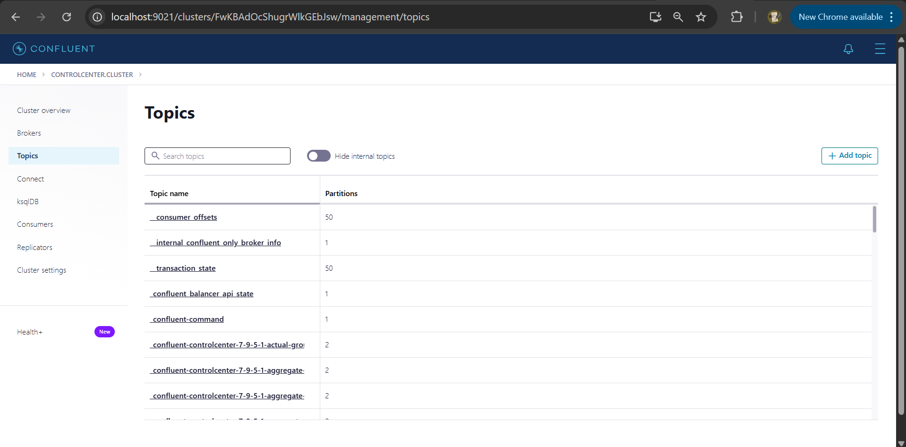
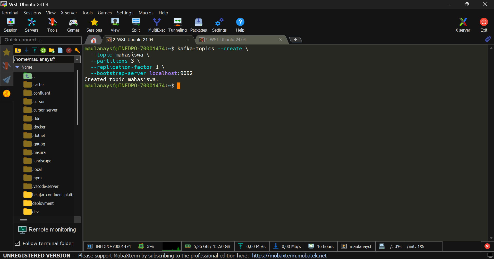
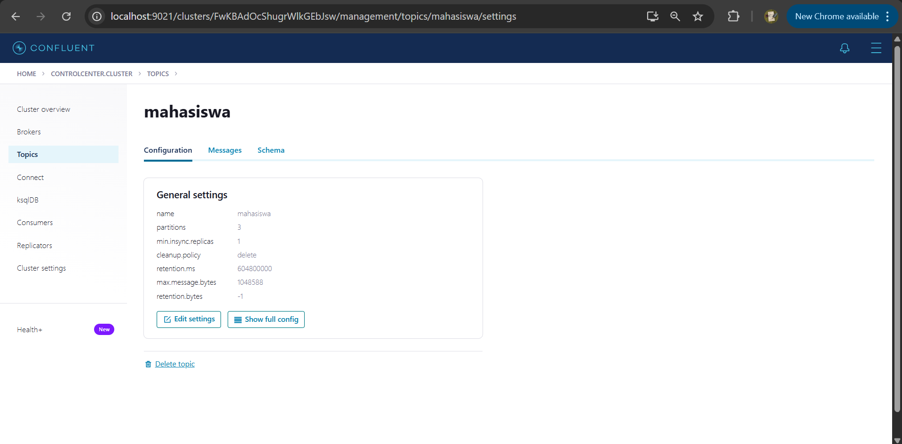
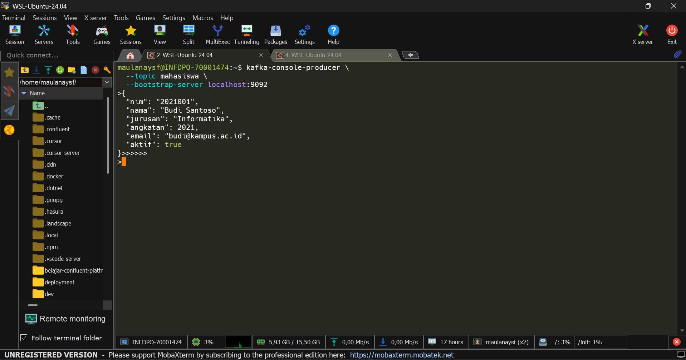
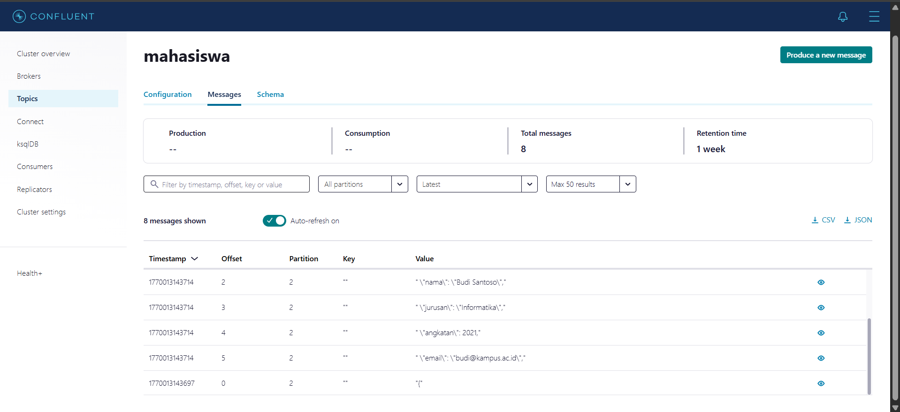
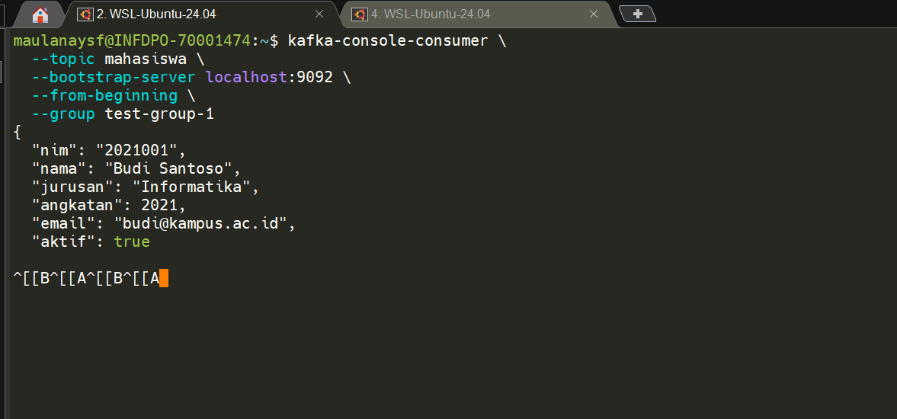

# create topic dengan cli

## jalankan semua service confluent
```
sudo systemctl start confluent-zookeeper
sudo systemctl start confluent-server
sudo systemctl start confluent-schema-registry
sudo systemctl start confluent-kafka-connect
sudo systemctl start confluent-ksqldb
sudo systemctl start confluent-kafka-rest
sudo systemctl start confluent-control-center
```

## coba akses c3

url **localhost:9021**




## tambahkan topic baru

topic ini bernama **mahasiswa**
```
kafka-topics --create \
  --topic mahasiswa \
  --partitions 3 \
  --replication-factor 1 \
  --bootstrap-server localhost:9092
```



di c3:



## setting schema untuk topic mahasiswa

schema digunakan untuk mendeklarasikan data yang akan dikirim oleh producer sehingga data tetap konsisten dan tidak berubah.

masuk ke c3 -> topics -> klik nama topic -> schema -> json
```
{
  "$schema": "http://json-schema.org/draft-07/schema#",
  "title": "Mahasiswa",
  "type": "object",
  "properties": {
    "nim": {
      "type": "string",
      "description": "Nomor Induk Mahasiswa"
    },
    "nama": {
      "type": "string",
      "description": "Nama lengkap mahasiswa"
    },
    "jurusan": {
      "type": "string"
    },
    "angkatan": {
      "type": "integer",
      "minimum": 2000
    },
    "email": {
      "type": "string",
      "format": "email"
    },
    "aktif": {
      "type": "boolean"
    }
  },
  "required": ["nim", "nama", "jurusan", "angkatan"],
  "additionalProperties": false
}
```

tambah value schema:


## testing produce data

```
kafka-console-producer \
  --topic mahasiswa \
  --bootstrap-server localhost:9092
```

**masukan datanya**
```
{
  "nim": "2021001",
  "nama": "Budi Santoso",
  "jurusan": "Informatika",
  "angkatan": 2021,
  "email": "budi@kampus.ac.id",
  "aktif": true
}
```





## consume data

```
kafka-console-consumer \
  --topic mahasiswa \
  --bootstrap-server localhost:9092 \
  --from-beginning \
  --group test-group-1
```

