# Prerequesites

1. install jdk (java development kit 11)

# Step Installasi CP

1. install jdk versi 17
`sudo apt update`
`sudo apt install openjdk-17-jre-headless` 
`java --version`

2. Buat sebuah direktori untuk menyimpan public key Confluent yang digunakan untuk menandatangani (sign) paket-paket Confluent di dalam repository APT.
`sudo mkdir -p /etc/apt/keyrings`

3. Download and install the Confluent public key
    ```
    wget -qO - https://packages.confluent.io/deb/7.9/archive.key | gpg \
    --dearmor | sudo tee /etc/apt/keyrings/confluent.gpg > /dev/null
    ```

4. add the Confluent Platform and client repositories:
    ```
    CP_DIST=$(lsb_release -cs)
    echo "Types: deb
    URIs: https://packages.confluent.io/deb/7.9
    Suites: stable
    Components: main
    Architectures: $(dpkg --print-architecture)
    Signed-by: /etc/apt/keyrings/confluent.gpg

    Types: deb
    URIs: https://packages.confluent.io/clients/deb/
    Suites: ${CP_DIST}
    Components: main
    Architectures: $(dpkg --print-architecture)
    Signed-By: /etc/apt/keyrings/confluent.gpg" | sudo tee /etc/apt/sources.list.d/confluent-platform.sources > /dev/null
    ```

5. Update apt-get and install the entire Confluent Platform package.
`sudo apt-get update && sudo apt-get install confluent-platform`

6. jalankan cp


   1. jalankan zookeper jika ingin menggunakannya, jika tidak skip ke langkah 2
    `sudo systemctl start confluent-zookeeper`
   2. jalankan kafka
    `sudo systemctl start confluent-server`
   3. jalankan schema registry
    `sudo systemctl start confluent-schema-registry`
   4. jalankan Kafka Connect
    `sudo systemctl start confluent-kafka-connect`
   6. jalankan ksqldb
    `sudo systemctl start confluent-ksqldb`
   5. jalankan Confluent REST Proxy
    `sudo systemctl start confluent-kafka-rest`
   7. jalankan control center
    `sudo systemctl start confluent-control-center`


perintah cepat jalankan semua
```
sudo systemctl start confluent-zookeeper
sudo systemctl start confluent-server
sudo systemctl start confluent-schema-registry
sudo systemctl start confluent-kafka-connect
sudo systemctl start confluent-ksqldb
sudo systemctl start confluent-kafka-rest
sudo systemctl start confluent-control-center
```

restart services
```
sudo systemctl restart confluent-zookeeper
sudo systemctl restart confluent-server
sudo systemctl restart confluent-schema-registry
sudo systemctl restart confluent-kafka-connect
sudo systemctl restart confluent-ksqldb
sudo systemctl restart confluent-kafka-rest
sudo systemctl restart confluent-control-center
```


perintah cpet stop semua
```
sudo systemctl stop confluent-control-center
sudo systemctl stop confluent-kafka-rest
sudo systemctl stop confluent-ksqldb
sudo systemctl stop confluent-kafka-connect
sudo systemctl stop confluent-schema-registry
sudo systemctl stop confluent-server
sudo systemctl stop confluent-zookeeper
```


cek semua services
```
systemctl list-units | grep confluent
```

7. uninstall
`sudo apt-get remove confluent-platform`


## note
 path config c3 
 `sudo nano /etc/confluent-control-center/control-center.properties`

 journal ctl cek log
 `journalctl -u confluent-control-center -n 200 --no-pager`
`journalctl -u confluent-control-center -f`

## Hasil Praktek

### 1. install jdk 17 di wsl lokal

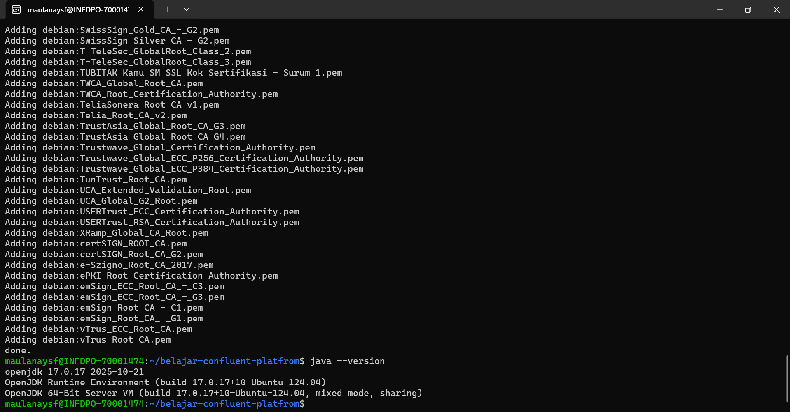

### 2. buat directory untuk simpan keyrings

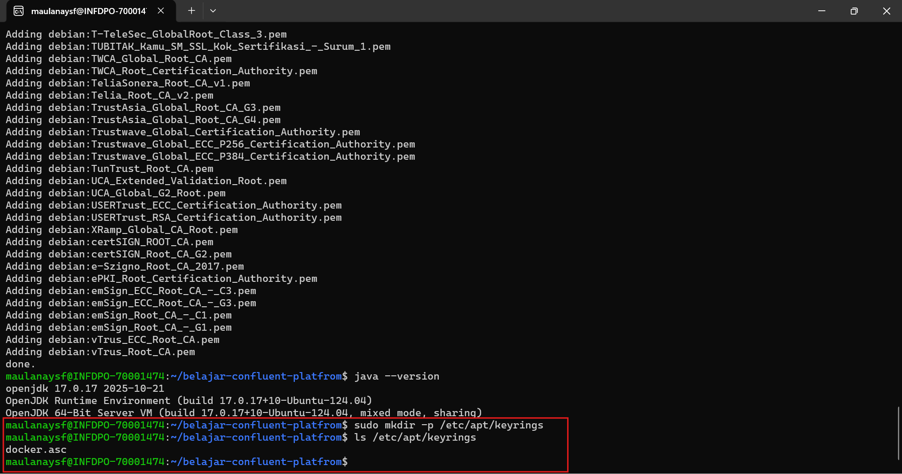

### 3. Download dan install confluent public key

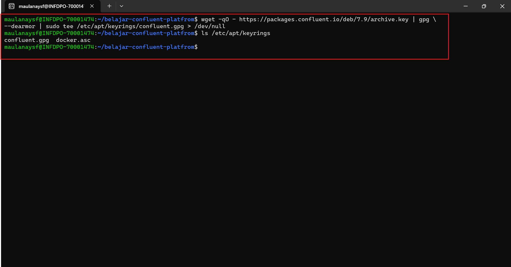

### 4. Tambahkan cp repositories

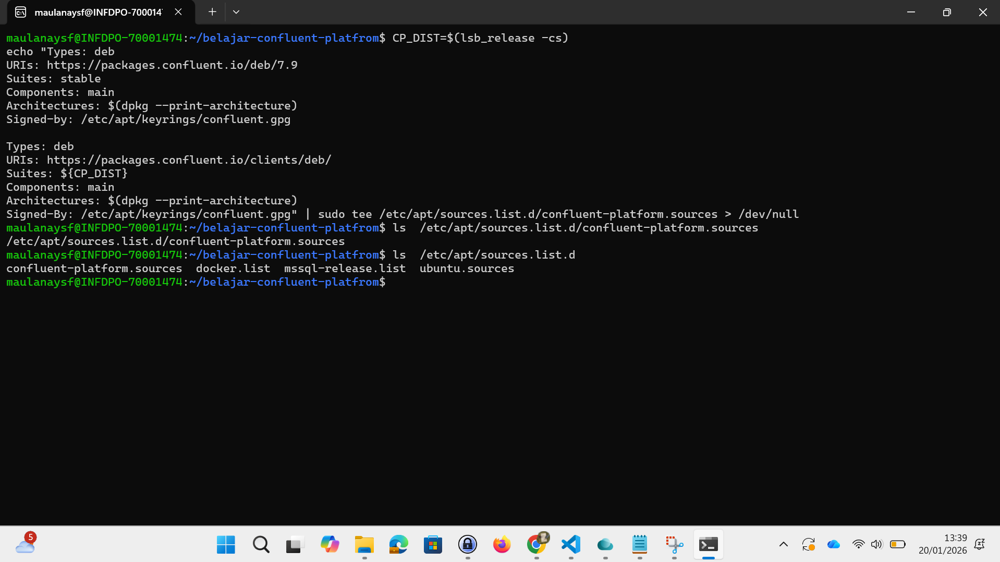

### 5. apt-get update dan install cp

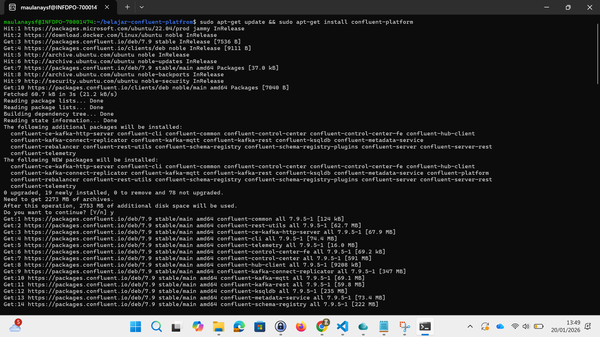

cek status confluent-server
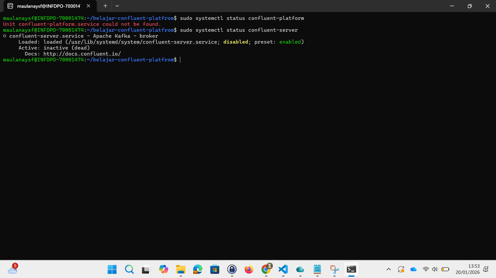

### 6. Jalankan CP

#### i. jalankan zookeper

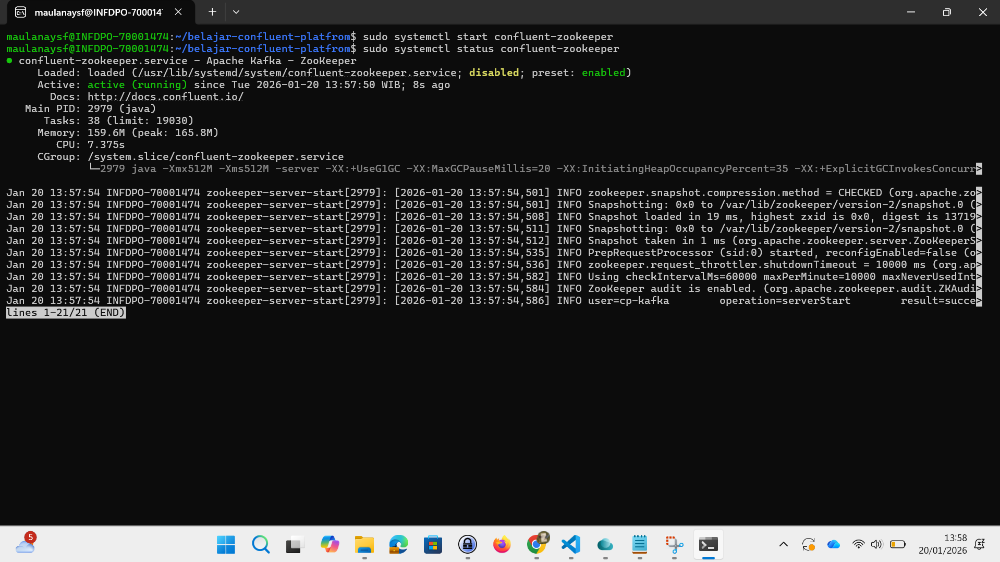

#### ii. Jalankan kafka (confluent-server)

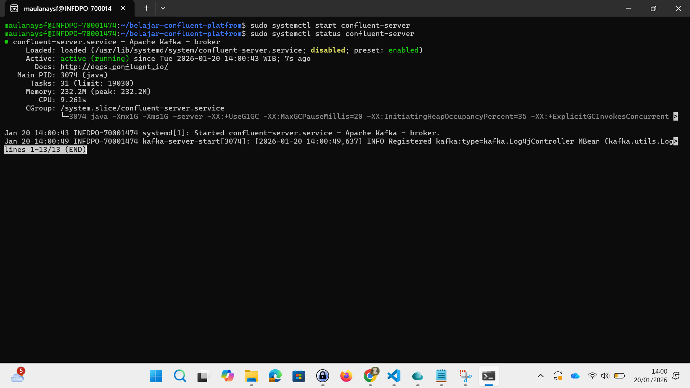

#### iii. jalankan schema-registry

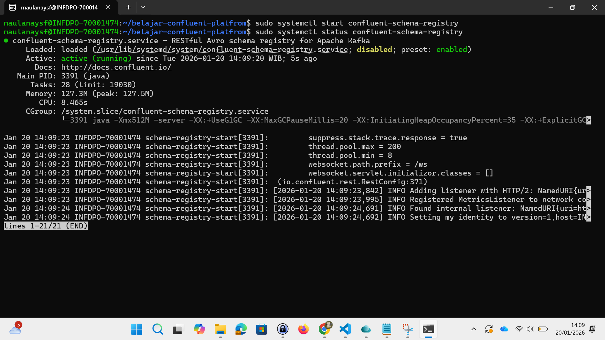

#### iv. jalankan kafka-connect

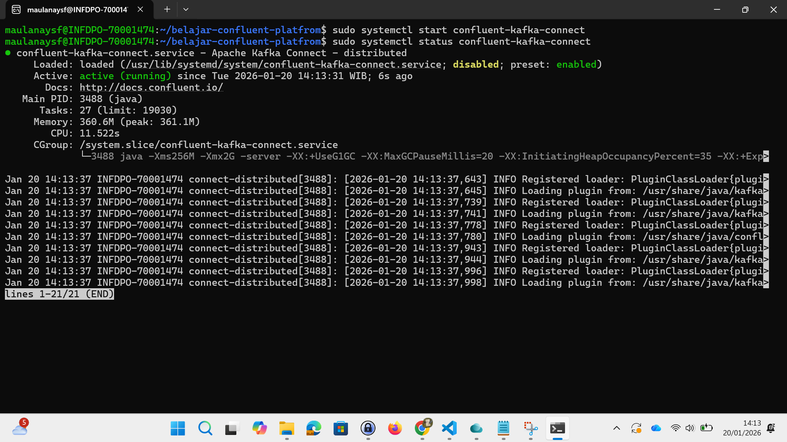

#### v. jalankan ksqldb

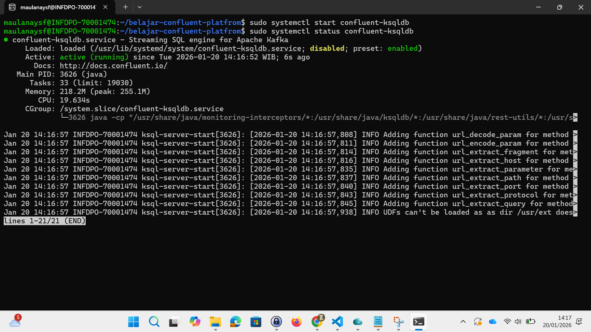

#### vi. jalankan kafka-rest

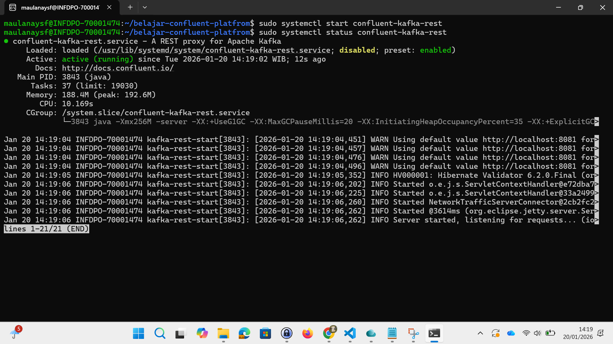

#### vii. jalankan control-center

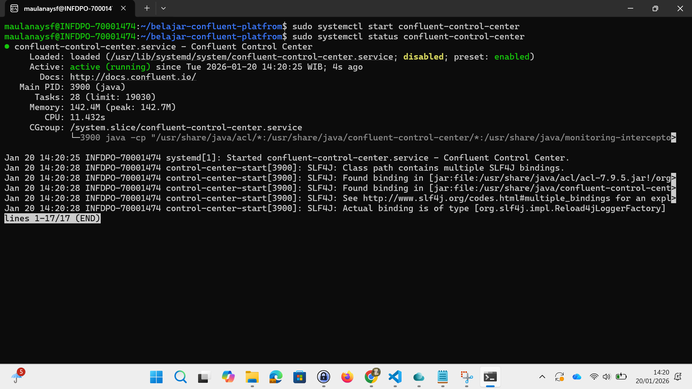

#### cek semua service cp

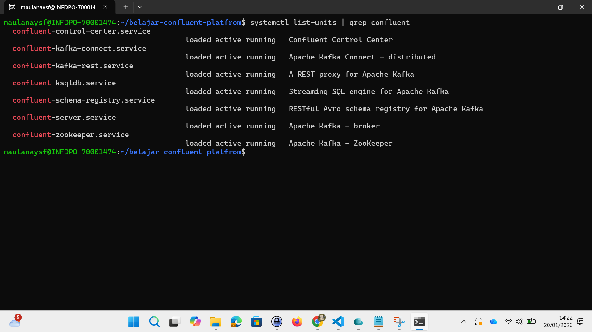

#### cek kafka sudah ready atau belum

`ss -tuln | grep 9092`

---

#### menjalankan c3

1. gunakan properties dev dengan path:
`ls /etc/confluent-control-center/`
`control-center-dev.properties`

2. cek startnya
`sudo systemctl cat confluent-control-center | grep ExecStart`

3. edit file /usr/lib/systemd/system/confluent-control-center.service
`sudo nano /usr/lib/systemd/system/confluent-control-center.service`
ubah production properties jadi dev properties

sudo systemctl daemon-reload
sudo systemctl restart confluent-control-center

### akses c3 

url
`http://localhost:9021/`

capture gambar:
