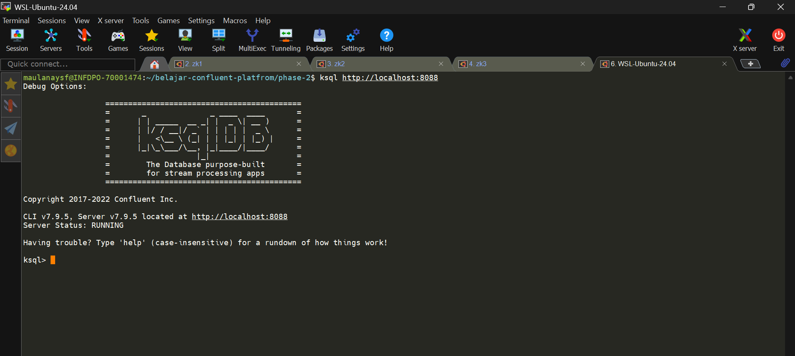
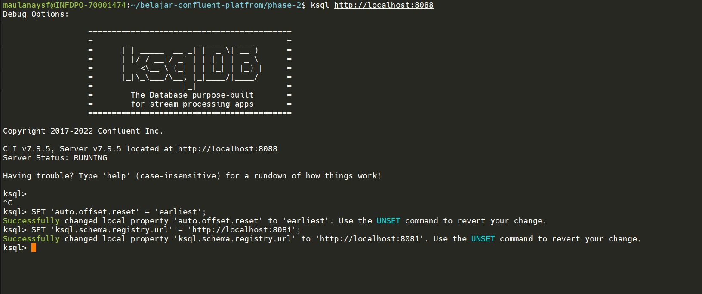
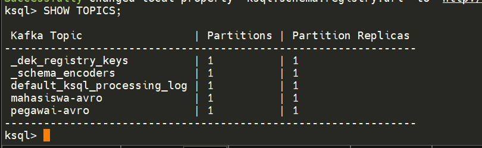

## Jalankan zookeeper quorum

```
sudo /usr/bin/zookeeper-server-start /etc/kafka/zookeeper1.properties
sudo /usr/bin/zookeeper-server-start /etc/kafka/zookeeper2.properties
sudo /usr/bin/zookeeper-server-start /etc/kafka/zookeeper3.properties
```

## Jalankan service cp lain

```
sudo systemctl start confluent-server
sudo systemctl start confluent-schema-registry
sudo systemctl start confluent-kafka-connect
sudo systemctl start confluent-ksqldb
sudo systemctl start confluent-kafka-rest
sudo systemctl start confluent-control-center
```

note: pastikan c3 jalan dan semua service cp jalan

---

## 1. Verifikasi ksqlDB Server

```
ccurl --silent http://localhost:8088/info | jq
```

jika berhasil akan ada informasi dari KsqlServerInfo.

## 2.  Masuk ke ksqlDB CLI

```
ksql http://localhost:8088
```

hasilnya:




## 3. Set ksqlDB Properties 

bisa sementara atau edit di file /etc/ksqldb/kasql-server.properties

```
SET 'auto.offset.reset' = 'earliest';
SET 'ksql.schema.registry.url'='http://localhost:8081';
```

hasilnya:



## 4. cek topic kafka

```
SHOW TOPICS;
```

hasilnya:


saya akan menggunakan topic `pegawai-avro` untuk membuat streams.

## 5. buat STREAMS dari topic pegawai-avro

buat streams berdasarkan dari value schema avro yang ada.

```
CREATE STREAM pegawai_stream (
  id INT,
  nama STRING,
  jabatan STRING,
  gaji DOUBLE,
  aktif BOOLEAN
)
WITH (
  KAFKA_TOPIC = 'pegawai-avro',
  VALUE_FORMAT = 'AVRO'
);
```