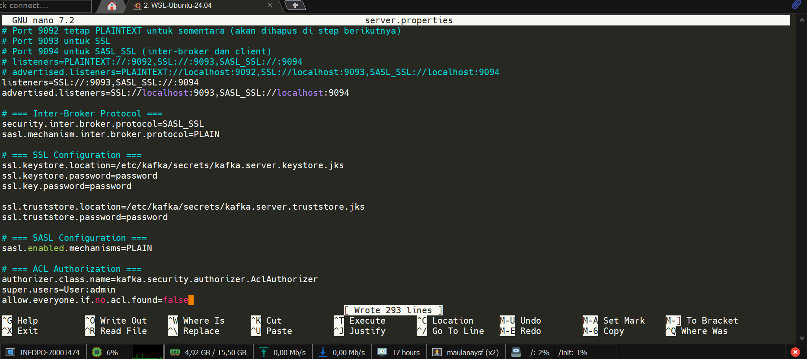
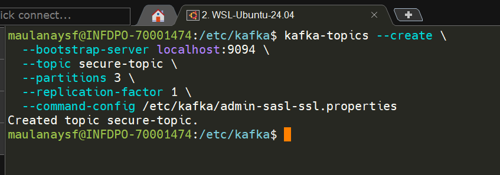
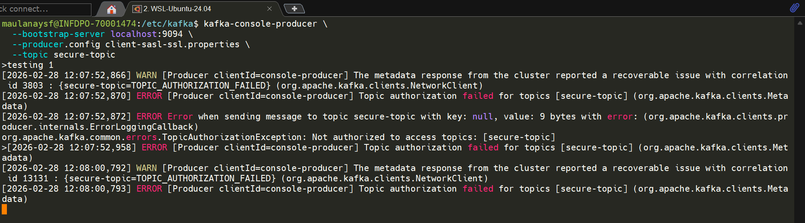
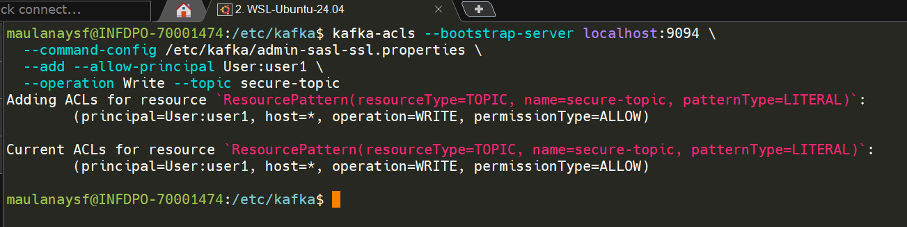
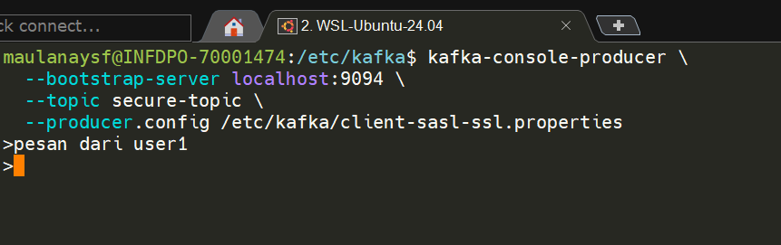
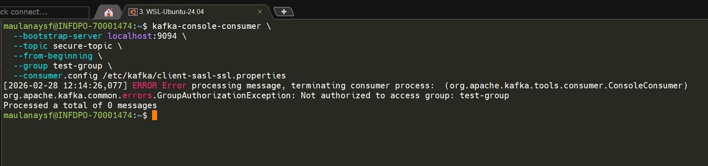

## Mengapa ACL Diperlukan?

Saat ini, meskipun sudah ada authentication, **semua user yang terautentikasi memiliki akses penuh** ke semua resource. user1 bisa baca semua topic, user2 bisa delete topic production, dst.

ACL memungkinkan kontrol granular:
- user1 hanya boleh **write** ke topic `orders`
- user2 hanya boleh **read** dari topic `orders`
- Tidak ada yang boleh **delete topic** kecuali admin

## 1 Enable Authorizer di server.properties

Tambahkan:

```properties
# === ACL Authorization ===
authorizer.class.name=kafka.security.authorizer.AclAuthorizer
super.users=User:admin
allow.everyone.if.no.acl.found=false
```


**Penjelasan:**

| Property | Fungsi |
|----------|--------|
| `authorizer.class.name` | Mengaktifkan ACL authorizer bawaan Kafka |
| `super.users=User:admin` | User "admin" bypass semua ACL — seperti root di Linux |
| `allow.everyone.if.no.acl.found=false` | Jika tidak ada ACL untuk resource, **DENY semua** (secure by default) |

> **Peringatan:** Setelah `allow.everyone.if.no.acl.found=false` diaktifkan, semua operasi non-admin akan gagal sampai ACL ditambahkan. Pastikan admin properties file sudah siap.

Restart broker:

```bash
sudo systemctl restart confluent-server
```

### cek list acl

```
kafka-acls \
  --bootstrap-server localhost:9094 \
  --command-config admin-sasl-ssl.properties \
  --list
```

## 2 Buat Topic untuk Testing ACL

```bash
kafka-topics --create \
  --bootstrap-server localhost:9094 \
  --topic secure-topic \
  --partitions 3 \
  --replication-factor 1 \
  --command-config /etc/kafka/admin-sasl-ssl.properties
```



> **Penting:** Gunakan `admin-sasl-ssl.properties` karena sekarang hanya super user yang bisa create topic.

---

## 🧪 3 FULL ACL TEST MATRIX

### Test A — No ACL (user1 produce → Harus Gagal)

```bash
kafka-console-producer \
  --bootstrap-server localhost:9094 \
  --topic secure-topic \
  --producer.config /etc/kafka/client-sasl-ssl.properties
```

**Expected:**

```
ERROR: Topic authorization failed.
org.apache.kafka.common.errors.TopicAuthorizationException: 
  Not authorized to access topics: [secure-topic]
```



**Penjelasan:** user1 terautentikasi, tapi tidak ada ACL yang mengizinkan akses ke `secure-topic`.

---

### Test B — Add Write ACL (user1 produce → Harus Berhasil)

```bash
kafka-acls --bootstrap-server localhost:9094 \
  --command-config /etc/kafka/admin-sasl-ssl.properties \
  --add --allow-principal User:user1 \
  --operation Write --topic secure-topic
```

Verifikasi ACL:

```bash
kafka-acls --bootstrap-server localhost:9094 \
  --command-config /etc/kafka/admin-sasl-ssl.properties \
  --list --topic secure-topic
```

**Expected output:**



```
Current ACLs for resource `ResourcePattern(resourceType=TOPIC, name=secure-topic, patternType=LITERAL)`:
  (principal=User:user1, host=*, operation=WRITE, permissionType=ALLOW)
```

Test produce:

```bash
kafka-console-producer \
  --bootstrap-server localhost:9094 \
  --topic secure-topic \
  --producer.config /etc/kafka/client-sasl-ssl.properties
```

**Expected:** Berhasil mengirim pesan.



```
>pesan dari user 1
>
```

Test consume (Harus Gagal):

```bash
kafka-console-consumer \
  --bootstrap-server localhost:9094 \
  --topic secure-topic \
  --from-beginning \
  --group test-group \
  --consumer.config /etc/kafka/client-sasl-ssl.properties
```


**Expected:**

```
ERROR: Topic authorization failed (Read operation not allowed)
```

**Penjelasan:** user1 hanya punya Write ACL, belum ada Read.

---

