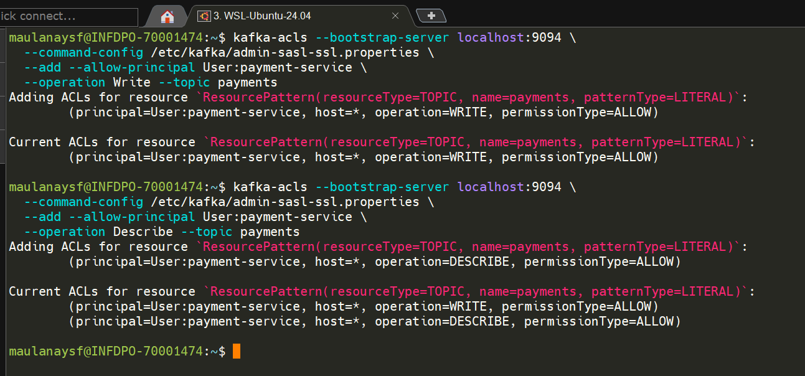
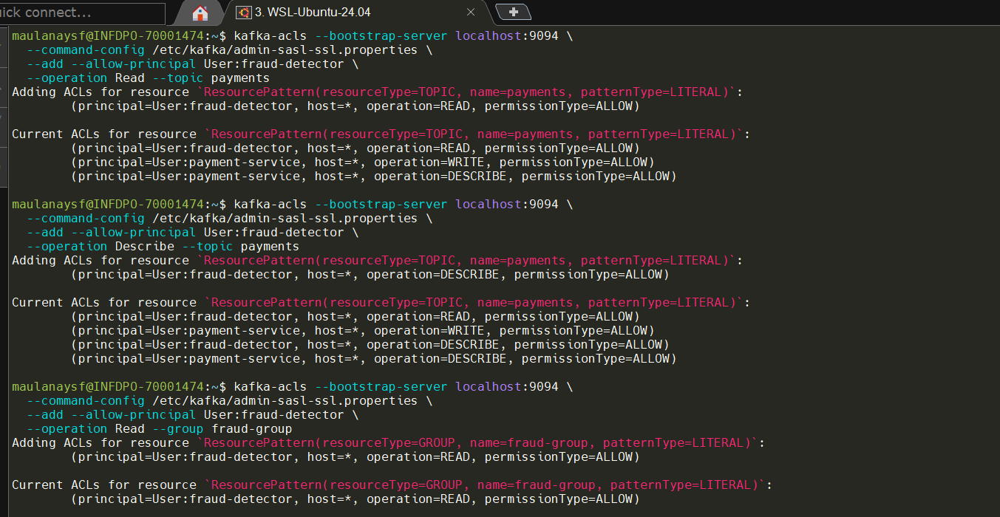
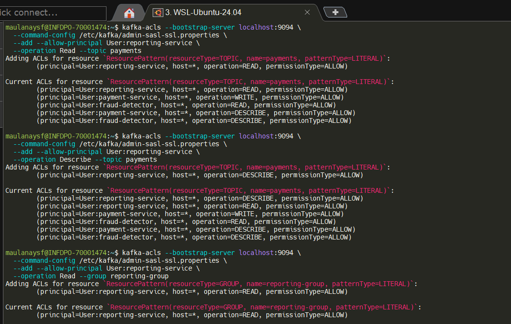
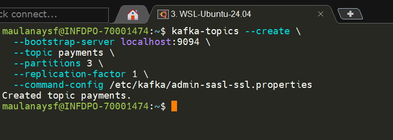
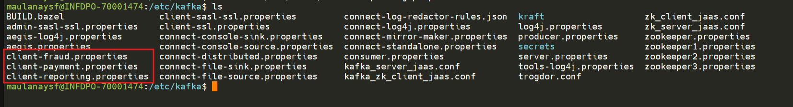
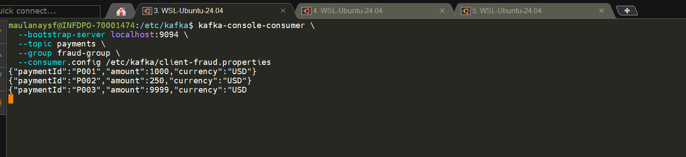

## end to end test scenario

### Payment Processing System

```
Producer (payment-service) → Topic: payments
Consumer (fraud-detector) → Topic: payments
Consumer (reporting-service) → Topic: payments
```

| User                | Allowed    |
| ------------------- | ---------- |
| payment-service     | Write only |
| fraud-detector      | Read only  |
| reporting-service   | Read only  |
| Tidak ada user lain | DENY       |


## setup ACL

**payment-service → Write Only**

```bash
kafka-acls --bootstrap-server localhost:9094 \
  --command-config /etc/kafka/admin-sasl-ssl.properties \
  --add --allow-principal User:payment-service \
  --operation Write --topic payments

kafka-acls --bootstrap-server localhost:9094 \
  --command-config /etc/kafka/admin-sasl-ssl.properties \
  --add --allow-principal User:payment-service \
  --operation Describe --topic payments
```

**hasilnya**



**fraud-detector → Read Only**

```bash
kafka-acls --bootstrap-server localhost:9094 \
  --command-config /etc/kafka/admin-sasl-ssl.properties \
  --add --allow-principal User:fraud-detector \
  --operation Read --topic payments

kafka-acls --bootstrap-server localhost:9094 \
  --command-config /etc/kafka/admin-sasl-ssl.properties \
  --add --allow-principal User:fraud-detector \
  --operation Describe --topic payments

kafka-acls --bootstrap-server localhost:9094 \
  --command-config /etc/kafka/admin-sasl-ssl.properties \
  --add --allow-principal User:fraud-detector \
  --operation Read --group fraud-group
```

**hasilnya**



**reporting-service → Read Only (Group berbeda)**

```bash
kafka-acls --bootstrap-server localhost:9094 \
  --command-config /etc/kafka/admin-sasl-ssl.properties \
  --add --allow-principal User:reporting-service \
  --operation Read --topic payments

kafka-acls --bootstrap-server localhost:9094 \
  --command-config /etc/kafka/admin-sasl-ssl.properties \
  --add --allow-principal User:reporting-service \
  --operation Describe --topic payments

kafka-acls --bootstrap-server localhost:9094 \
  --command-config /etc/kafka/admin-sasl-ssl.properties \
  --add --allow-principal User:reporting-service \
  --operation Read --group reporting-group
```
**hasilnya**




## create topic payment (user:Admin)

```bash
kafka-topics --create \
  --bootstrap-server localhost:9094 \
  --topic payments \
  --partitions 3 \
  --replication-factor 1 \
  --command-config /etc/kafka/admin-sasl-ssl.properties
```

**hasilnya**


## create config file 

```bash
# file etc/kafka/client-payment.properties
security.protocol=SASL_SSL
sasl.mechanism=PLAIN
ssl.truststore.location=/etc/kafka/secrets/kafka.server.truststore.jks
ssl.truststore.password=password

sasl.jaas.config=org.apache.kafka.common.security.plain.PlainLoginModule required \
  username="payment-service" \
  password="payment-secret";

# file /etc/kafka/client-fraud.properties
security.protocol=SASL_SSL
sasl.mechanism=PLAIN
ssl.truststore.location=/etc/kafka/secrets/kafka.server.truststore.jks
ssl.truststore.password=password

sasl.jaas.config=org.apache.kafka.common.security.plain.PlainLoginModule required \
  username="fraud-detector" \
  password="fraud-secret";

# file /etc/kafka/client-reporting.properties
security.protocol=SASL_SSL
sasl.mechanism=PLAIN
ssl.truststore.location=/etc/kafka/secrets/kafka.server.truststore.jks
ssl.truststore.password=password

sasl.jaas.config=org.apache.kafka.common.security.plain.PlainLoginModule required \
  username="reporting-service" \
  password="reporting-secret";
```

**hasilnya**


## Tambahkan username di file jaas

**file /etc/kafka/kafka_server_jaas.conf**
```bash
KafkaServer {
  org.apache.kafka.common.security.plain.PlainLoginModule required
  username="admin"
  password="admin-secret"
  user_admin="admin-secret"
  user_user1="user1-secret"
  user_user2="user2-secret"
  user_payment-service="payment-secret"
  user_fraud-detector="fraud-secret"
  user_reporting-service="reporting-secret";
};

Client {
  org.apache.zookeeper.server.auth.DigestLoginModule required
  username="zkadmin"
  password="zkadmin-secret";
};
```

**retart broker**
```bash
sudo systemctl restart confluent-server
```


---

## Testing

### Positive Flow Test

**Terminal 1 — fraud-detector Consumer**

```bash
kafka-console-consumer \
  --bootstrap-server localhost:9094 \
  --topic payments \
  --group fraud-group \
  --consumer.config /etc/kafka/client-fraud.properties
```

**Terminal 2 — reporting-service Consumer**

```bash
kafka-console-consumer \
  --bootstrap-server localhost:9094 \
  --topic payments \
  --group reporting-group \
  --consumer.config /etc/kafka/client-reporting.properties
```

**Terminal 3 — payment-service Producer**

```bash
kafka-console-producer \
  --bootstrap-server localhost:9094 \
  --topic payments \
  --producer.config /etc/kafka/client-payment.properties
```
produce message:

```bash
{"paymentId":"P001","amount":1000,"currency":"USD"}
{"paymentId":"P002","amount":250,"currency":"USD"}
{"paymentId":"P003","amount":9999,"currency":"USD"}
```

**expexted result**

| Service           | Expected             |
| ----------------- | -------------------- |
| fraud-detector    | Menerima semua pesan |
| reporting-service | Menerima semua pesan |
| payment-service   | Berhasil produce     |


**hasilnya**

