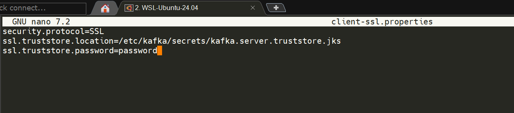
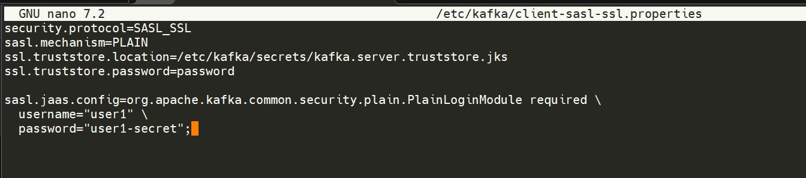
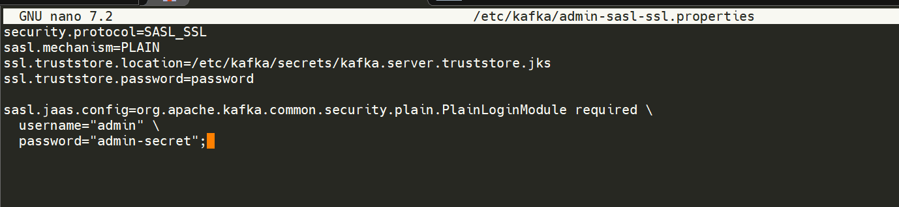
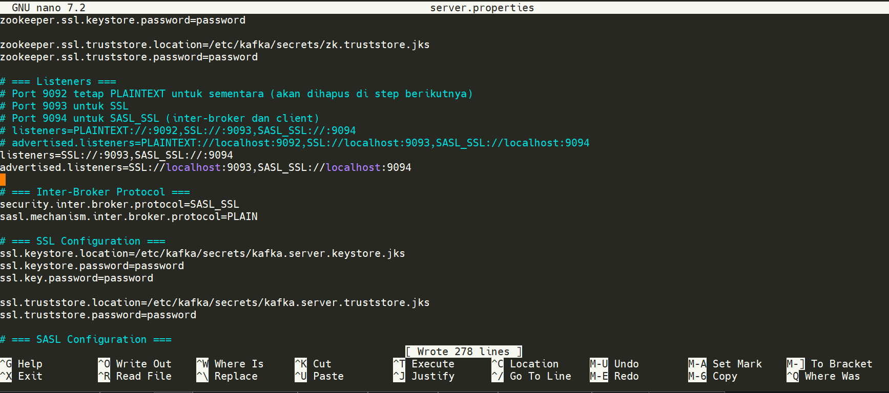
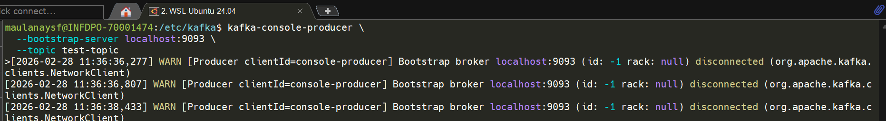
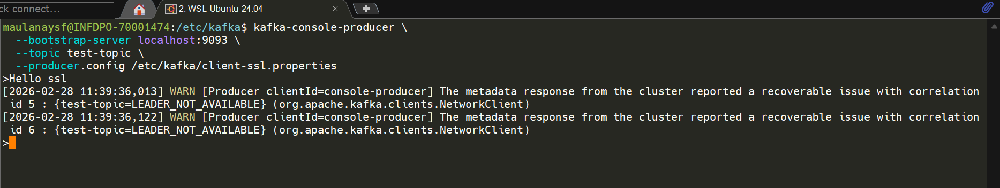
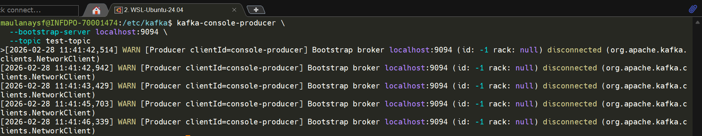
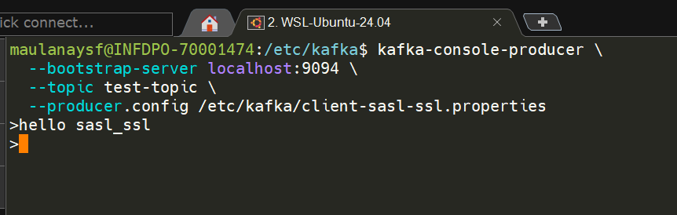
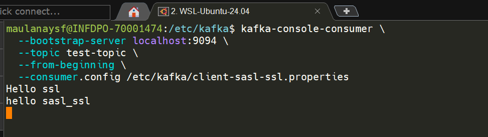

## 1 Buat Client Properties File

### File: `client-ssl.properties` (SSL Only)

```properties
security.protocol=SSL
ssl.truststore.location=/etc/kafka/secrets/kafka.server.truststore.jks
ssl.truststore.password=password
```


### File: `client-sasl-ssl.properties` (SASL + SSL — Recommended)

```properties
security.protocol=SASL_SSL
sasl.mechanism=PLAIN
ssl.truststore.location=/etc/kafka/secrets/kafka.server.truststore.jks
ssl.truststore.password=password

sasl.jaas.config=org.apache.kafka.common.security.plain.PlainLoginModule required \
  username="user1" \
  password="user1-secret";
```


### File: `admin-sasl-ssl.properties` (Admin User)

```properties
security.protocol=SASL_SSL
sasl.mechanism=PLAIN
ssl.truststore.location=/etc/kafka/secrets/kafka.server.truststore.jks
ssl.truststore.password=password

sasl.jaas.config=org.apache.kafka.common.security.plain.PlainLoginModule required \
  username="admin" \
  password="admin-secret";
```


## 2 (Opsional) Hapus PLAINTEXT Listener

Setelah semua komponen sudah menggunakan SSL/SASL_SSL, hapus PLAINTEXT listener untuk keamanan penuh.

Update `server.properties`:

```properties
# Hapus PLAINTEXT, hanya sisakan SSL dan SASL_SSL
listeners=SSL://:9093,SASL_SSL://:9094
advertised.listeners=SSL://localhost:9093,SASL_SSL://localhost:9094
```



Restart broker:

```bash
sudo systemctl restart confluent-server
```

> **Peringatan:** Setelah PLAINTEXT dihapus, semua tool CLI harus menggunakan `--command-config` dengan properties file yang sesuai.

## 3 Update Schema Registry & Control Center (Opsional)

Jika menggunakan Schema Registry dan Control Center, update konfigurasi mereka juga:

### Schema Registry (`schema-registry.properties`)

```properties
kafkastore.bootstrap.servers=SASL_SSL://localhost:9094
kafkastore.security.protocol=SASL_SSL
kafkastore.sasl.mechanism=PLAIN
kafkastore.sasl.jaas.config=org.apache.kafka.common.security.plain.PlainLoginModule required \
  username="admin" \
  password="admin-secret";
kafkastore.ssl.truststore.location=/etc/kafka/secrets/kafka.server.truststore.jks
kafkastore.ssl.truststore.password=password
```

### Control Center (`control-center.properties`)

```properties
bootstrap.servers=SASL_SSL://localhost:9094
confluent.controlcenter.streams.security.protocol=SASL_SSL
confluent.controlcenter.streams.sasl.mechanism=PLAIN
confluent.controlcenter.streams.sasl.jaas.config=org.apache.kafka.common.security.plain.PlainLoginModule required \
  username="admin" \
  password="admin-secret";
confluent.controlcenter.streams.ssl.truststore.location=/etc/kafka/secrets/kafka.server.truststore.jks
confluent.controlcenter.streams.ssl.truststore.password=password
```

### atur pengiriman metrics menggunakan sasl_ssl (`server.properties`)

```
confluent.metrics.reporter.bootstrap.servers=localhost:9094
confluent.metrics.reporter.security.protocol=SASL_SSL
confluent.metrics.reporter.sasl.mechanism=PLAIN
confluent.metrics.reporter.sasl.jaas.config=org.apache.kafka.common.security.plain.PlainLoginModule required \
  username="admin" \
  password="admin-secret";

confluent.metrics.reporter.ssl.truststore.location=/etc/kafka/secrets/kafka.server.truststore.jks
confluent.metrics.reporter.ssl.truststore.password=password
```
Restart broker:

```bash
sudo systemctl restart confluent-server
```

---

## 4 Testing Kafka Client Security

### Test 1 — SSL Tanpa Config (Harus Gagal)

```bash
kafka-console-producer \
  --bootstrap-server localhost:9093 \
  --topic test-topic
```

**Expected:**

```
ERROR: SSL handshake failed
org.apache.kafka.common.errors.SslAuthenticationException
```


**Penjelasan:** Client mencoba connect ke SSL port tanpa truststore, sehingga tidak bisa verifikasi certificate broker.

### Test 2 — SSL Dengan Config (Harus Berhasil)

```bash
kafka-console-producer \
  --bootstrap-server localhost:9093 \
  --topic test-topic \
  --producer.config /etc/kafka/client-ssl.properties
```

**Expected:** Producer prompt muncul, bisa mengetik pesan.

```
>Hello SSL
>Test message
>
```




### Test 3 — SASL_SSL Tanpa Credential (Harus Gagal)

```bash
kafka-console-producer \
  --bootstrap-server localhost:9094 \
  --topic test-topic
```

**Expected:**

```
ERROR: SASL authentication failed
org.apache.kafka.common.errors.SaslAuthenticationException: Authentication failed
```


**Penjelasan:** Client tidak menyediakan username/password untuk SASL authentication.


### Test 4 — SASL_SSL Dengan Credential Benar (Harus Berhasil)

```bash
kafka-console-producer \
  --bootstrap-server localhost:9094 \
  --topic test-topic \
  --producer.config /etc/kafka/client-sasl-ssl.properties
```

**Expected:** Producer prompt muncul.

```
>Hello SASL_SSL
>Authenticated message
>
```


### Test 5 — Consume via SASL_SSL

```bash
kafka-console-consumer \
  --bootstrap-server localhost:9094 \
  --topic test-topic \
  --from-beginning \
  --consumer.config /etc/kafka/client-sasl-ssl.properties
```

**Expected:** Pesan yang diproduce sebelumnya muncul.



---