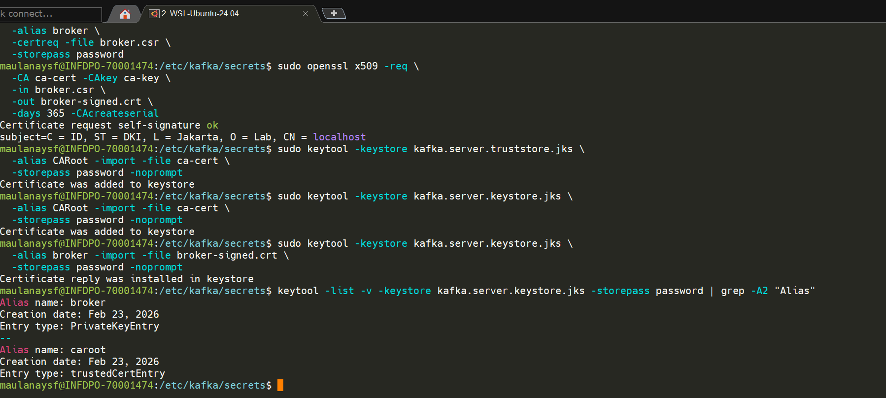
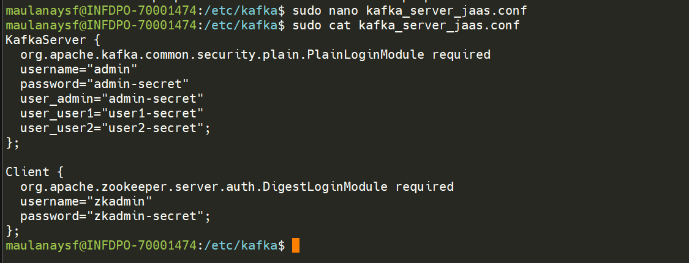
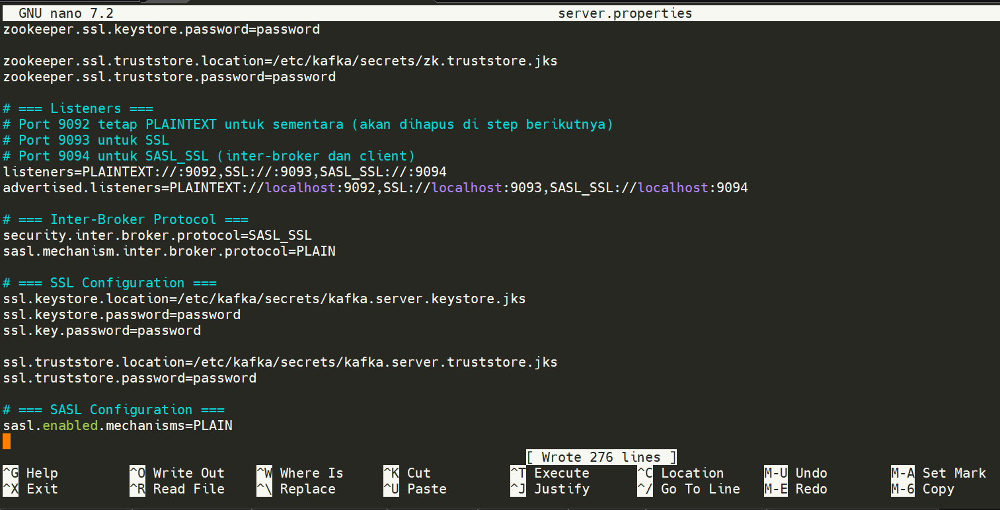
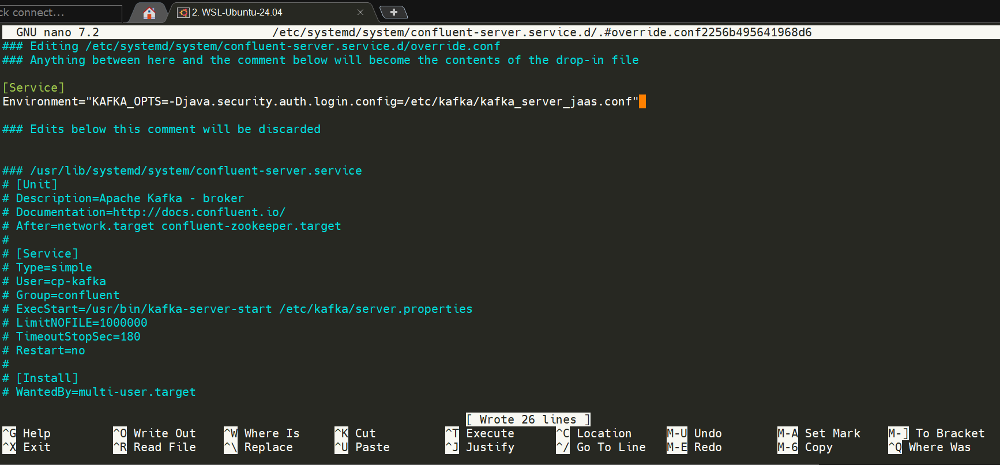
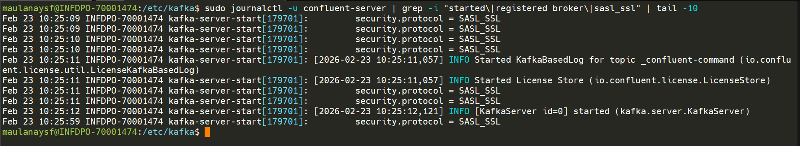
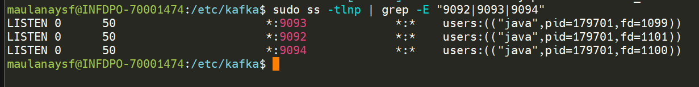
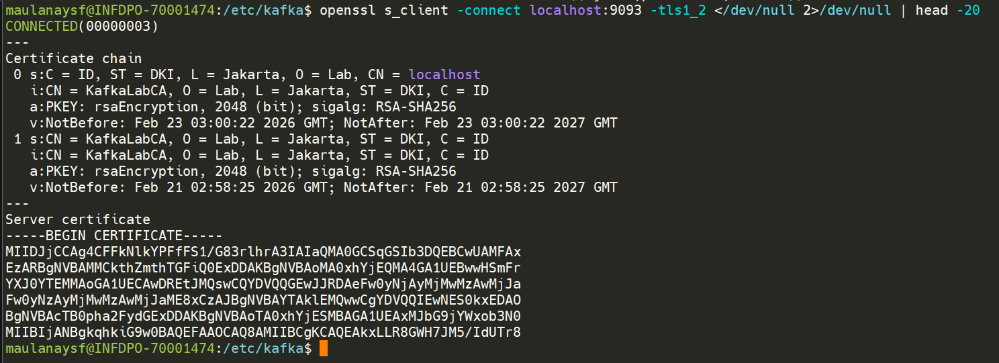
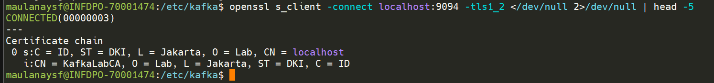

## 1 Generate Broker Keystore & Truststore

```bash
cd /etc/kafka/secrets

# Generate Broker Keystore
sudo keytool -keystore kafka.server.keystore.jks \
  -alias broker \
  -validity 365 \
  -genkey -keyalg RSA \
  -dname "CN=localhost,O=Lab,L=Jakarta,ST=DKI,C=ID" \
  -storepass password \
  -keypass password

# Create CSR
sudo keytool -keystore kafka.server.keystore.jks \
  -alias broker \
  -certreq -file broker.csr \
  -storepass password

# Sign with CA
sudo openssl x509 -req \
  -CA ca-cert -CAkey ca-key \
  -in broker.csr \
  -out broker-signed.crt \
  -days 365 -CAcreateserial

# Create Truststore
sudo keytool -keystore kafka.server.truststore.jks \
  -alias CARoot -import -file ca-cert \
  -storepass password -noprompt

# Import CA cert ke keystore
sudo keytool -keystore kafka.server.keystore.jks \
  -alias CARoot -import -file ca-cert \
  -storepass password -noprompt

# Import signed cert ke keystore
sudo keytool -keystore kafka.server.keystore.jks \
  -alias broker -import -file broker-signed.crt \
  -storepass password -noprompt
```

**Verifikasi:**

```bash
keytool -list -v -keystore kafka.server.keystore.jks -storepass password | grep -A2 "Alias"
```


## 2 Buat JAAS File untuk Kafka Broker

Buat file `/etc/kafka/kafka_server_jaas.conf`:

```properties
KafkaServer {
  org.apache.kafka.common.security.plain.PlainLoginModule required
  username="admin"
  password="admin-secret"
  user_admin="admin-secret"
  user_user1="user1-secret"
  user_user2="user2-secret";
};

Client {
  org.apache.zookeeper.server.auth.DigestLoginModule required
  username="zkadmin"
  password="zkadmin-secret";
};
```

**Penjelasan detail:**

| Property | Fungsi |
|----------|--------|
| `username="admin"` | Username yang digunakan broker ini untuk inter-broker authentication |
| `password="admin-secret"` | Password broker ini untuk inter-broker authentication |
| `user_admin="admin-secret"` | Mendefinisikan user "admin" dengan password "admin-secret" |
| `user_user1="user1-secret"` | Mendefinisikan user "user1" — akan digunakan oleh client |
| `user_user2="user2-secret"` | Mendefinisikan user "user2" — akan digunakan oleh client |
| Section `Client` | Credential untuk connect ke ZooKeeper (dari step sebelumnya) |




> **Penting:** `username` dan `password` di level KafkaServer adalah credential yang digunakan broker untuk berkomunikasi dengan broker lain. Format `user_<username>="<password>"` mendefinisikan user database.

## 3 Update server.properties (Inter-Broker)

```properties
# === Listeners ===
# Port 9092 tetap PLAINTEXT untuk sementara (akan dihapus di step berikutnya)
# Port 9093 untuk SSL
# Port 9094 untuk SASL_SSL (inter-broker dan client)
listeners=PLAINTEXT://:9092,SSL://:9093,SASL_SSL://:9094
advertised.listeners=PLAINTEXT://localhost:9092,SSL://localhost:9093,SASL_SSL://localhost:9094

# === Inter-Broker Protocol ===
security.inter.broker.protocol=SASL_SSL
sasl.mechanism.inter.broker.protocol=PLAIN

# === SSL Configuration ===
ssl.keystore.location=/etc/kafka/secrets/kafka.server.keystore.jks
ssl.keystore.password=password
ssl.key.password=password

ssl.truststore.location=/etc/kafka/secrets/kafka.server.truststore.jks
ssl.truststore.password=password

# === SASL Configuration ===
sasl.enabled.mechanisms=PLAIN
```


## 4 Update Environment Variable

Edit `override file untuk confluent-server`:

```bash
sudo systemctl edit confluent-server

# replace Environment="KAFKA_OPTS=-Djava.security.auth.login.config=/etc/kafka/kafka_zk_client_jaas.conf"
# dengan

Environment="KAFKA_OPTS=-Djava.security.auth.login.config=/etc/kafka/kafka_server_jaas.conf"
```
Save dan keluar.



### 4.1 Reload systemd
```
sudo systemctl daemon-reload
```

> **Catatan:** File JAAS ini sekarang berisi section `KafkaServer` (untuk broker) DAN section `Client` (untuk koneksi ke ZooKeeper).

## 5 Restart Kafka Broker

```bash
sudo systemctl restart confluent-server
```

---

## 6 Testing Kafka Inter-Broker Security

### Test 1 — Verifikasi Broker Start dengan SASL_SSL

```
sudo journalctl -u confluent-server | grep -i "started\|registered broker\|sasl_ssl" | tail -10
```

**Actual result:**
```
security.protocol = SASL_SSL
INFO [KafkaServer id=0] started (kafka.server.KafkaServer)
```


> **Penjelasan:** `security.protocol = SASL_SSL` membuktikan inter-broker protocol sudah dikonfigurasi SASL_SSL.
> `[KafkaServer id=0] started` membuktikan broker berhasil start dengan konfigurasi tersebut. ✅

### Test 2 — Verifikasi Port Listening

```bash
sudo ss -tlnp | grep -E "9092|9093|9094"
```

**Expected:**

```
LISTEN  0  50  *:9092  *:*  users:(("java",...))
LISTEN  0  50  *:9093  *:*  users:(("java",...))
LISTEN  0  50  *:9094  *:*  users:(("java",...))
```



### Test 3 — SSL Handshake Test

```bash
openssl s_client -connect localhost:9093 -tls1_2 </dev/null 2>/dev/null | head -20
```


**Expected:** Menampilkan certificate chain dan "SSL handshake has read ... bytes".

### Test 4 — Verifikasi SASL_SSL Port

```bash
openssl s_client -connect localhost:9094 -tls1_2 </dev/null 2>/dev/null | head -5
```


**Expected:** SSL connection established (SASL authentication belum dilakukan, tapi SSL layer berjalan).

### Test 5 — Kafka Metadata Request via PLAINTEXT (Masih Bekerja)

```bash
kafka-broker-api-versions --bootstrap-server localhost:9092
```


**Expected:** Menampilkan daftar API versions. PLAINTEXT masih aktif karena belum dihapus.
