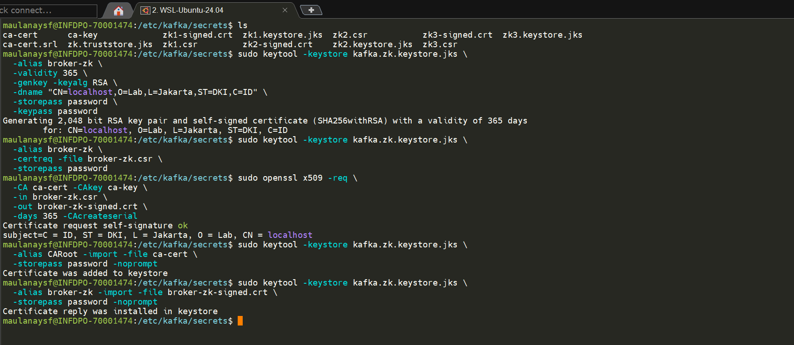
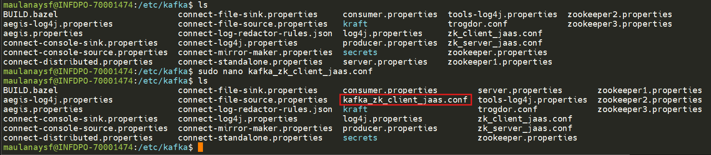
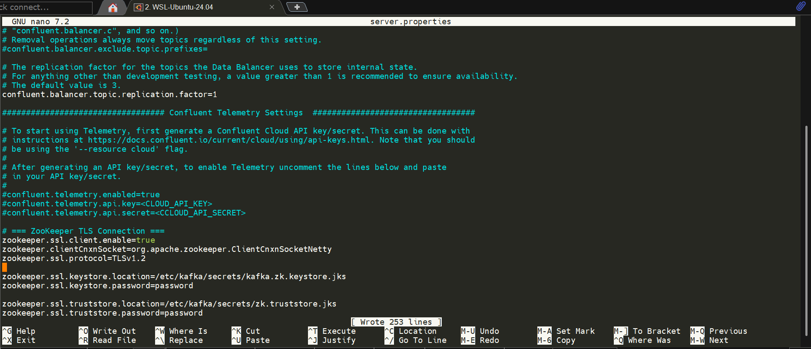
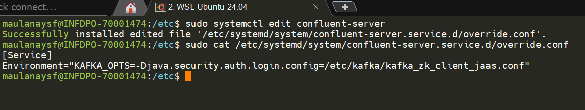
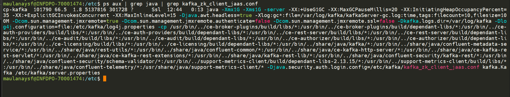
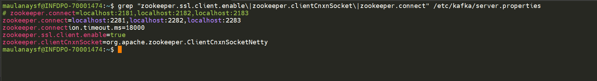
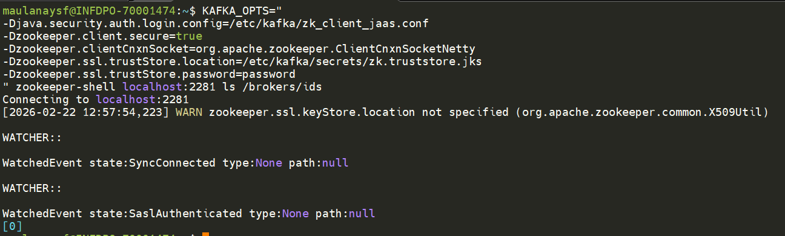
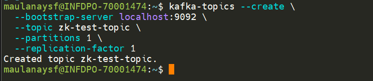
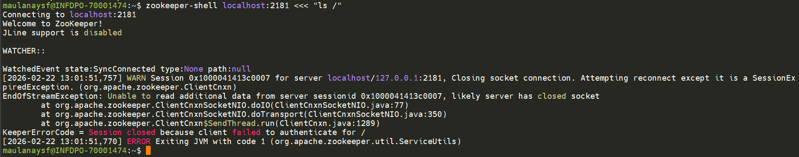
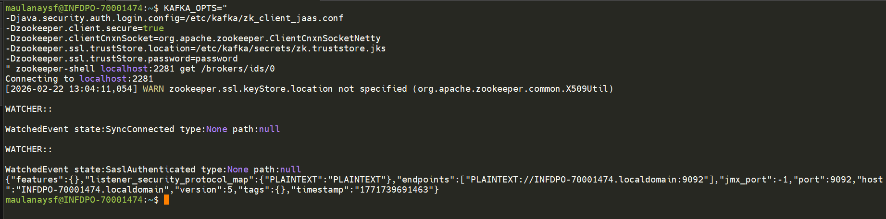

## 1 Generate Broker Keystore untuk ZK Connection

```bash
cd /etc/kafka/secrets

# Generate keystore untuk broker (koneksi ke ZK)
sudo keytool -keystore kafka.zk.keystore.jks \
  -alias broker-zk \
  -validity 365 \
  -genkey -keyalg RSA \
  -dname "CN=localhost,O=Lab,L=Jakarta,ST=DKI,C=ID" \
  -storepass password \
  -keypass password

# Create CSR
sudo keytool -keystore kafka.zk.keystore.jks \
  -alias broker-zk \
  -certreq -file broker-zk.csr \
  -storepass password

# Sign dengan CA
sudo openssl x509 -req \
  -CA ca-cert -CAkey ca-key \
  -in broker-zk.csr \
  -out broker-zk-signed.crt \
  -days 365 -CAcreateserial

# Import CA cert ke keystore
sudo keytool -keystore kafka.zk.keystore.jks \
  -alias CARoot -import -file ca-cert \
  -storepass password -noprompt

# Import signed cert ke keystore
sudo keytool -keystore kafka.zk.keystore.jks \
  -alias broker-zk -import -file broker-zk-signed.crt \
  -storepass password -noprompt
```

**hasilnya:**



## 2 Buat JAAS File untuk Kafka (sebagai ZK Client)

Buat file `/etc/kafka/kafka_zk_client_jaas.conf`:

```properties
Client {
  org.apache.zookeeper.server.auth.DigestLoginModule required
  username="zkadmin"
  password="zkadmin-secret";
};
```

**hasilnya:**




> **Section `Client`** digunakan oleh Kafka ketika connect ke ZooKeeper sebagai client.

## 3 Update server.properties (ZooKeeper Connection)

Tambahkan ke `server.properties`:

```properties
# === ZooKeeper TLS Connection ===
zookeeper.ssl.client.enable=true
zookeeper.clientCnxnSocket=org.apache.zookeeper.ClientCnxnSocketNetty
zookeeper.ssl.protocol=TLSv1.2

zookeeper.ssl.keystore.location=/etc/kafka/secrets/kafka.zk.keystore.jks
zookeeper.ssl.keystore.password=password

zookeeper.ssl.truststore.location=/etc/kafka/secrets/zk.truststore.jks
zookeeper.ssl.truststore.password=password

# Update zookeeper.connect jika menggunakan secure port
# zookeeper.connect=localhost:2181,localhost:2182,localhost:2183
zookeeper.connect=localhost:2281,localhost:2282,localhost:2283
```

**hasilnya :**



## 4 Set Environment Variable untuk confluent-server (systemd)

### 4.1. Buat override file
Jalankan:
```
sudo systemctl edit confluent-server

# Ini akan membuka editor dan membuat file:
/etc/systemd/system/confluent-server.service.d/override.conf
```
isi dengan:
```bash
[Service]
Environment="KAFKA_OPTS=-Djava.security.auth.login.config=/etc/kafka/kafka_zk_client_jaas.conf"
```
**hasilnya:**


Save dan keluar.

### 4.2. Reload systemd
```
sudo systemctl daemon-reload
```

## 5 Restart Kafka Broker

```bash
sudo systemctl restart confluent-server
```

### 5.1. Verifikasi JAAS Ter-load
Cek dengan:
```
ps aux | grep java | grep kafka_zk_client_jaas.conf
```
Harus muncul:
```
-Djava.security.auth.login.config=/etc/kafka/kafka_zk_client_jaas.conf
```
**hasilnya :**



Kalau tidak muncul → JAAS tidak ter-load.

---

## 6 Testing ZooKeeper Client & Kafka↔ZK Connection

### Test 1 — Verifikasi Broker Connect ke ZK via SSL

```bash
grep "zookeeper.ssl.client.enable\|zookeeper.clientCnxnSocket\|zookeeper.connect" /etc/kafka/server.properties
```
- Broker dikonfigurasi untuk connect via SSL (zookeeper.ssl.client.enable=true, port 2281)

**hasilnya:**



### Test 2 — Broker Registered di ZK

```bash
# Gunakan ZK shell dengan SSL config
KAFKA_OPTS="
-Djava.security.auth.login.config=/etc/kafka/zk_client_jaas.conf
-Dzookeeper.client.secure=true
-Dzookeeper.clientCnxnSocket=org.apache.zookeeper.ClientCnxnSocketNetty
-Dzookeeper.ssl.trustStore.location=/etc/kafka/secrets/zk.truststore.jks
-Dzookeeper.ssl.trustStore.password=password
" zookeeper-shell localhost:2281 ls /brokers/ids
```

**Expected:**

```
[0]   # atau ID broker Anda
```



- Broker berhasil register ke ZK yang hanya bisa diakses via SSL port → berarti koneksi SSL berhasil

### Test 3 — Kafka Masih Bisa Membuat Topic

```bash
kafka-topics --create \
  --bootstrap-server localhost:9092 \
  --topic zk-test-topic \
  --partitions 1 \
  --replication-factor 1
```

**Expected:**

```
Created topic zk-test-topic.
```



### Test 4 — Non-SSL ZK Client Ditolak

```bash
# Coba connect ZK shell tanpa SSL config
zookeeper-shell localhost:2181 <<< "ls /"
```

**Expected:** Koneksi gagal atau timeout karena ZK sekarang require SSL.


### Test 5 — Verifikasi Metadata via ZK

```bash
KAFKA_OPTS="
-Djava.security.auth.login.config=/etc/kafka/zk_client_jaas.conf
-Dzookeeper.client.secure=true
-Dzookeeper.clientCnxnSocket=org.apache.zookeeper.ClientCnxnSocketNetty
-Dzookeeper.ssl.trustStore.location=/etc/kafka/secrets/zk.truststore.jks
-Dzookeeper.ssl.trustStore.password=password
" zookeeper-shell localhost:2281 get /brokers/ids/0
```


**Expected:** Menampilkan metadata broker (host, port, endpoints).

**hasilnya:**


---