## 1 Buat Folder Secret

```bash
sudo mkdir -p /etc/kafka/secrets
cd /etc/kafka/secrets
```

## 2 Generate CA (Certificate Authority)

CA adalah **root of trust**. semua certificate akan ditandatangani oleh CA ini.

```bash
sudo openssl req -new -x509 \
  -keyout ca-key \
  -out ca-cert \
  -days 365 \
  -nodes \
  -subj "/CN=KafkaLabCA/O=Lab/L=Jakarta/ST=DKI/C=ID"
```

### verivikasi ca

```
sudo openssl x509 -in ca-cert -text -noout | head -20
```

hasilnya:

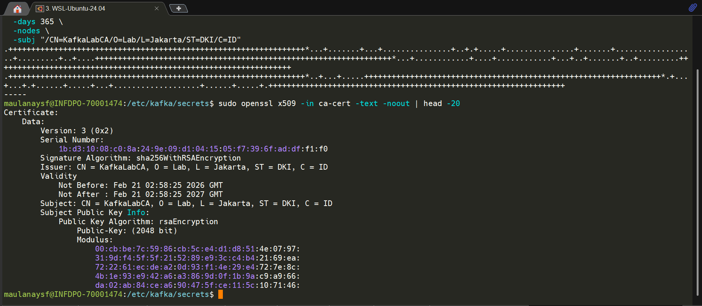

## 3. Generate ZooKeeper Keystore & Truststore

Buat keystore dan truststore untuk setiap ZooKeeper node.

### Generate Keystore (per node)

```
# Node 1
sudo keytool -keystore zk1.keystore.jks \
  -alias zk1 \
  -validity 365 \
  -genkey -keyalg RSA \
  -dname "CN=localhost,O=Lab,L=Jakarta,ST=DKI,C=ID" \
  -storepass password \
  -keypass password

# Node 2
sudo keytool -keystore zk2.keystore.jks \
  -alias zk2 \
  -validity 365 \
  -genkey -keyalg RSA \
  -dname "CN=localhost,O=Lab,L=Jakarta,ST=DKI,C=ID" \
  -storepass password \
  -keypass password

# Node 3
sudo keytool -keystore zk3.keystore.jks \
  -alias zk3 \
  -validity 365 \
  -genkey -keyalg RSA \
  -dname "CN=localhost,O=Lab,L=Jakarta,ST=DKI,C=ID" \
  -storepass password \
  -keypass password
```

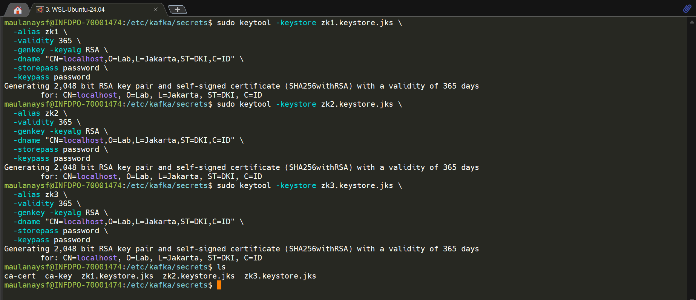

### Create CSR, Sign, dan Import (per node)

lakukan langkah dibawah untuk setiap node, dengan mengganti file zk untuk node 1,2,3

contoh untuk node 1:
```
# 1. Create CSR
sudo keytool -keystore zk3.keystore.jks \
  -alias zk3 \
  -certreq -file zk3.csr \
  -storepass password

# 2. Sign dengan CA
sudo openssl x509 -req \
  -CA ca-cert -CAkey ca-key \
  -in zk3.csr \
  -out zk3-signed.crt \
  -days 365 -CAcreateserial

# 3. Import CA cert ke keystore
sudo keytool -keystore zk3.keystore.jks \
  -alias CARoot -import -file ca-cert \
  -storepass password -noprompt

# 4. Import signed cert ke keystore
sudo keytool -keystore zk3.keystore.jks \
  -alias zk3 -import -file zk3-signed.crt \
  -storepass password -noprompt
```

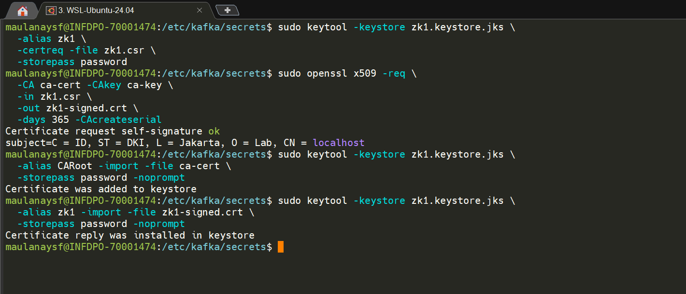

### Generate Truststore (shared untuk semua node)

```
sudo keytool -keystore zk.truststore.jks \
  -alias CARoot -import -file ca-cert \
  -storepass password -noprompt
```

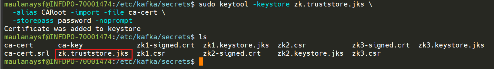

### Verifikasi keystore dan truststore:

```
# List isi keystore
keytool -list -keystore zk1.keystore.jks -storepass password

# List isi truststore
keytool -list -keystore zk.truststore.jks -storepass password
```

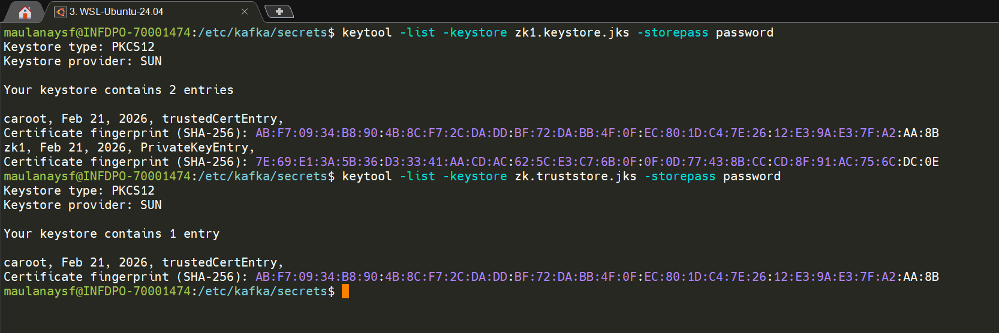

## 4. Buat JAAS File untuk ZooKeeper

File JAAS mendefinisikan credential untuk authentication antar ZooKeeper nodes.

### buat file `/etc/kafka/zk_server_jaas.conf`

isikan dengan config dibawah ini

```
Server {
  org.apache.zookeeper.server.auth.DigestLoginModule required
  user_zkadmin="zkadmin-secret";
};

QuorumServer {
  org.apache.zookeeper.server.auth.DigestLoginModule required
  user_zkadmin="zkadmin-secret";
};

QuorumLearner {
  org.apache.zookeeper.server.auth.DigestLoginModule required
  username="zkadmin"
  password="zkadmin-secret";
};
```
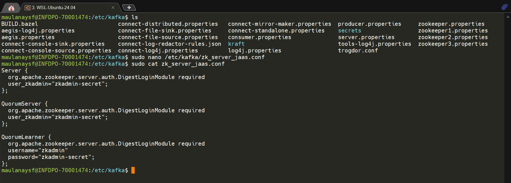

**Penjelasan setiap section:**

| Section | Fungsi |
|---------|--------|
| `Server` | Authentication untuk client yang connect ke ZooKeeper |
| `QuorumServer` | Authentication ketika node lain connect ke node ini |
| `QuorumLearner` | Credential yang digunakan node ini untuk connect ke node lain |


### buat File /etc/kafka/zk_client_jaas.conf (untuk testing client):

```bash
Client {
  org.apache.zookeeper.server.auth.DigestLoginModule required
  username="zkadmin"
  password="zkadmin-secret";
};
```

> Penting: zk_server_jaas.conf untuk ZK server process. zk_client_jaas.conf untuk client yang connect ke ZK (termasuk zookeeper-shell). Keduanya file terpisah karena section JAAS yang dibutuhkan berbeda.

## 5. Update zookeeper.properties (Setiap Node)

### Node 1 (/etc/kafka/zookeeper1.properties)

```
# === SSL Quorum (antar ZooKeeper nodes) ===
sslQuorum=true
ssl.quorum.keyStore.location=/etc/kafka/secrets/zk1.keystore.jks
ssl.quorum.keyStore.password=password
ssl.quorum.trustStore.location=/etc/kafka/secrets/zk.truststore.jks
ssl.quorum.trustStore.password=password

# === SASL Authentication ===
authProvider.1=org.apache.zookeeper.server.auth.SASLAuthenticationProvider
requireClientAuthScheme=sasl
enforce.auth.enabled=true
enforce.auth.schemes=sasl

# === Secure Client Port (SSL) ===
secureClientPort=2281
serverCnxnFactory=org.apache.zookeeper.server.NettyServerCnxnFactory
ssl.clientAuth=none
ssl.keyStore.location=/etc/kafka/secrets/zk1.keystore.jks
ssl.keyStore.password=password
ssl.trustStore.location=/etc/kafka/secrets/zk.truststore.jks
ssl.trustStore.password=password
```

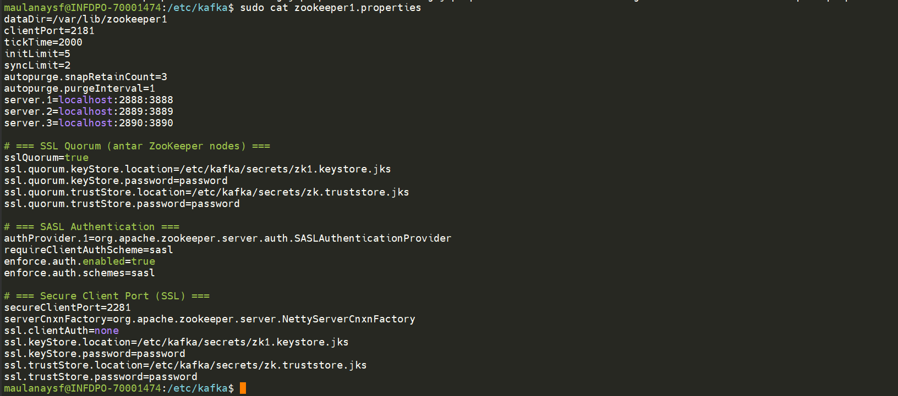

### Node 2 (/etc/kafka/zookeeper2.properties)

```
# === SSL Quorum (antar ZooKeeper nodes) ===
sslQuorum=true
ssl.quorum.keyStore.location=/etc/kafka/secrets/zk2.keystore.jks
ssl.quorum.keyStore.password=password
ssl.quorum.trustStore.location=/etc/kafka/secrets/zk.truststore.jks
ssl.quorum.trustStore.password=password

# === SASL Authentication ===
authProvider.1=org.apache.zookeeper.server.auth.SASLAuthenticationProvider
requireClientAuthScheme=sasl
enforce.auth.enabled=true
enforce.auth.schemes=sasl

# === Secure Client Port (SSL) ===
secureClientPort=2282
serverCnxnFactory=org.apache.zookeeper.server.NettyServerCnxnFactory
ssl.clientAuth=none
ssl.keyStore.location=/etc/kafka/secrets/zk2.keystore.jks
ssl.keyStore.password=password
ssl.trustStore.location=/etc/kafka/secrets/zk.truststore.jks
ssl.trustStore.password=password
```

### Node 3 (/etc/kafka/zookeeper3.properties)

```
# === SSL Quorum (antar ZooKeeper nodes) ===
sslQuorum=true
ssl.quorum.keyStore.location=/etc/kafka/secrets/zk3.keystore.jks
ssl.quorum.keyStore.password=password
ssl.quorum.trustStore.location=/etc/kafka/secrets/zk.truststore.jks
ssl.quorum.trustStore.password=password

# === SASL Authentication ===
authProvider.1=org.apache.zookeeper.server.auth.SASLAuthenticationProvider
requireClientAuthScheme=sasl
enforce.auth.enabled=true
enforce.auth.schemes=sasl

# === Secure Client Port (SSL) ===
secureClientPort=2283
serverCnxnFactory=org.apache.zookeeper.server.NettyServerCnxnFactory
ssl.clientAuth=none
ssl.keyStore.location=/etc/kafka/secrets/zk3.keystore.jks
ssl.keyStore.password=password
ssl.trustStore.location=/etc/kafka/secrets/zk.truststore.jks
ssl.trustStore.password=password
```

### Perbedaan Property SSL di ZooKeeper

| Property | Scope | Untuk |
|----------|-------|-------|
| `ssl.quorum.keyStore.*` | Quorum | Komunikasi antar ZK nodes (port 2888/3888) |
| `ssl.quorum.trustStore.*` | Quorum | Verifikasi certificate ZK nodes lain |
| `ssl.keyStore.*` | Client | Secure client port (secureClientPort) |
| `ssl.trustStore.*` | Client | Verifikasi certificate client (jika clientAuth=need) |

## 6. Set Environment Variable untuk ZooKeeper

Edit file `/etc/default/zookeeper` (atau service file masing-masing node):

```bash
KAFKA_OPTS="-Djava.security.auth.login.config=/etc/kafka/zk_server_jaas.conf"
```
> **Karna kita menggunakan 3 node (3 port berbeda) dalam 1 server, kita menjalankan zookeeper dengan manual command**
> **Sehingga untuk `Set Environment Variable` kita cukup export langsung tepat sebelum melakukan restart service zookeeper**

## 7. Restart Semua ZooKeeper Nodes

```bash
export KAFKA_OPTS="-Djava.security.auth.login.config=/etc/kafka/zk_server_jaas.conf"

# Restart satu per satu, mulai dari follower
# Start masing-masing di background dengan -daemon
sudo -E /usr/bin/zookeeper-server-start -daemon /etc/kafka/zookeeper1.properties
sudo -E /usr/bin/zookeeper-server-start -daemon /etc/kafka/zookeeper2.properties
sudo -E /usr/bin/zookeeper-server-start -daemon /etc/kafka/zookeeper3.properties
```

> **Penting:** Restart secara rolling — satu node selesai dulu, baru restart node berikutnya. Jangan restart semua sekaligus karena quorum bisa hilang.
> `sudo -E` → flag `-E` meneruskan environment variable (`KAFKA_OPTS`) ke proses sudo. Tanpa `-E`, sudo akan strip environment variable dan JAAS tidak ter-load.
> `-daemon` → menjalankan ZooKeeper di background. Tanpa ini, terminal akan terkunci di node pertama dan tidak bisa start node 2 dan 3 di terminal yang sama dan harus membuat sesi terminal baru.


**Verifikasi JAAS Ter-load**
```
# Cek apakah KAFKA_OPTS masuk ke proses Java
ps aux | grep zookeeper | grep jaas
sudo ss -tlnp | grep -E "2181|2182|2183|2281|2282|2283"
```
**Expected:** Muncul 3 proses Java dengan `-Djava.security.auth.login.config=/etc/kafka/zk_server_jaas.conf`.
Kalau kosong, berarti `-E` tidak bekerja. Alternatifnya, edit langsung di start script `/usr/bin/zookeeper-server-start` tepat baris terakhir sebelum baris command `exec`.

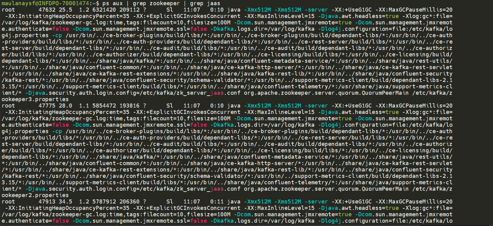

**proses service zookeeper**
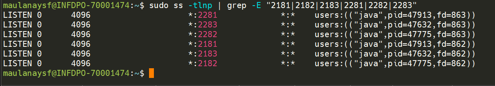

**cara mematikan prosesnya**

```bash
sudo ss -tlnp | grep -E "2181|2182|2183|2281|2282|2283"
sudo kill <pid>
```

## 8. Testing ZooKeeper Quorum Security

### Test 1 — Verifikasi Quorum & Leader Election

```bash
for port in 2181 2182 2183; do echo "Port $port: $(echo ruok | nc localhost $port)"; done
```

**Expected:** Setiap node merespons `imok`.

Verifikasi via log:
```bash
sudo grep -a -i "ssl handshake complete\|LEADING\|FOLLOWING\|Using TLS encrypted" \
/var/log/kafka/zookeeper.out | tail -10
```

**result:**

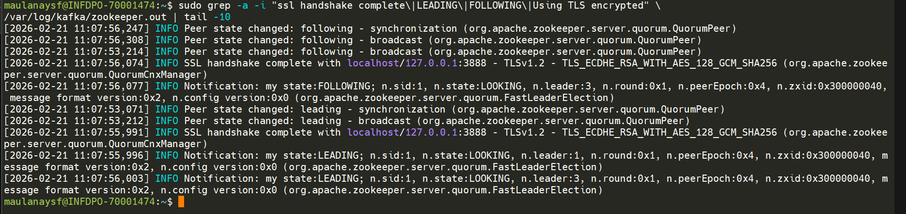

### Test 2 — Plain Connection Tanpa SASL (Harus Ditolak) 

```bash
unset KAFKA_OPTS
zookeeper-shell localhost:2181
```

**result**

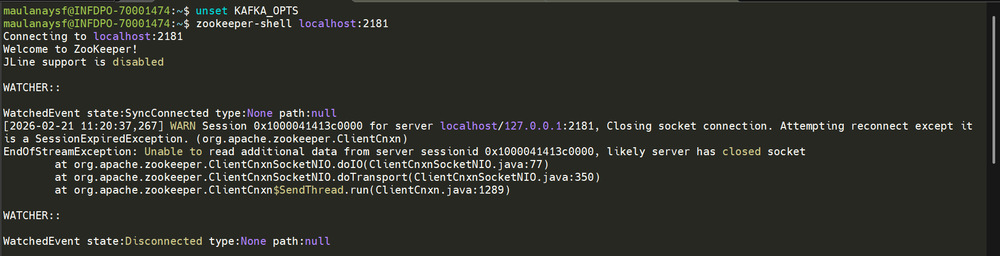

cek log zookeeper.out

```bash
 sudo grep -a -i "authentication scheme" /var/log/kafka/zookeeper.out
```


> Client tanpa SASL credential hanya membawa scheme [ip]. ZK membutuhkan [sasl] → session ditolak. SASL enforcement bekerja.

### Test 3 — Plain Connection Dengan SASL (Harus Berhasil)

```bash
KAFKA_OPTS="-Djava.security.auth.login.config=/etc/kafka/zk_client_jaas.conf" zookeeper-shell localhost:2181
```
**result**

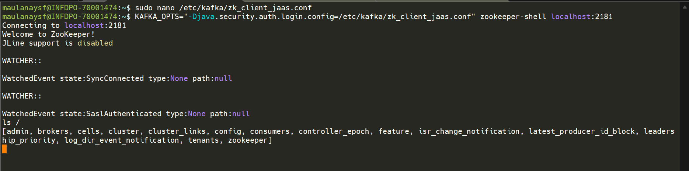

## Test 4 — Verifikasi SSL pada Secure Client Port

```bash
echo "" | sudo openssl s_client -connect localhost:2281 -CAfile /etc/kafka/secrets/ca-cert 2>&1 | grep -i "verify\|subject\|issuer\|handshake"
```

**result**

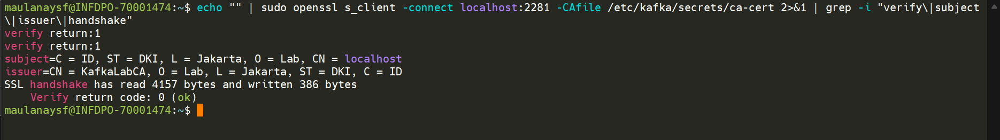

## Test 5 — ZooKeeper Shell via Secure Port Dengan SASL (Harus Berhasil)

```bash
KAFKA_OPTS="
-Djava.security.auth.login.config=/etc/kafka/zk_client_jaas.conf
-Dzookeeper.client.secure=true
-Dzookeeper.clientCnxnSocket=org.apache.zookeeper.ClientCnxnSocketNetty
-Dzookeeper.ssl.protocol=TLSv1.2
-Dzookeeper.ssl.trustStore.location=/etc/kafka/secrets/zk.truststore.jks
-Dzookeeper.ssl.trustStore.password=password
-Dzookeeper.ssl.keyStore.location=/etc/kafka/secrets/zk1.keystore.jks
-Dzookeeper.ssl.keyStore.password=password
" zookeeper-shell localhost:2281
```

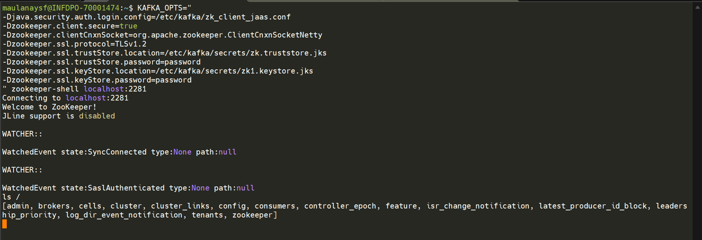