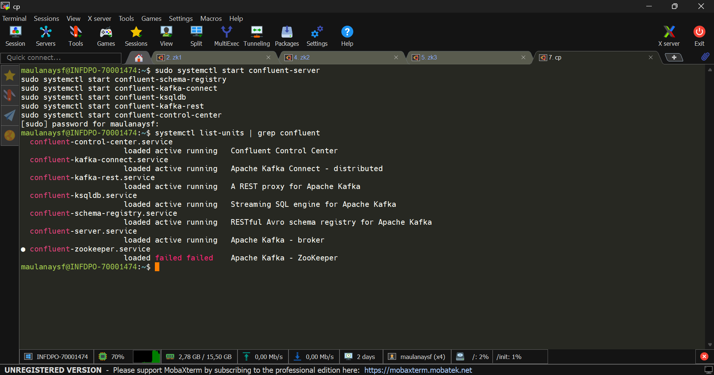

## Jalankan zookeeper quorum

```
sudo /usr/bin/zookeeper-server-start /etc/kafka/zookeeper1.properties
sudo /usr/bin/zookeeper-server-start /etc/kafka/zookeeper2.properties
sudo /usr/bin/zookeeper-server-start /etc/kafka/zookeeper3.properties
```

## Jalankan service cp lain

```
sudo systemctl start confluent-server
sudo systemctl start confluent-schema-registry
sudo systemctl start confluent-kafka-connect
sudo systemctl start confluent-ksqldb
sudo systemctl start confluent-kafka-rest
sudo systemctl start confluent-control-center
```



---

## Membuat schema avro mahasiswa

buat sebuah file schema dengan nama **mahasiswa.avsc** simpan di folder belajar cp. dengan isi sebagai berikut

```
{
  "type": "record",
  "name": "Mahasiswa",
  "namespace": "com.example",
  "fields": [
    { "name": "nim", "type": "string" },
    { "name": "nama", "type": "string" },
    { "name": "jurusan", "type": "string" },
    { "name": "angkatan", "type": "int" },
    { "name": "ipk", "type": "float" }
  ]
}
```


## buat topic dengan nama mahasiswa-avro

buat topic kafka dengan menggunakan cli.

```
kafka-topics --bootstrap-server localhost:9092 \
  --create \
  --topic mahasiswa-avro \
  --partitions 1 \
  --replication-factor 1
```


verifikasi menggunakan command:

```
kafka-topics --bootstrap-server localhost:9092 --list | grep mahasiswa
```

## produce data menggunakan avro

kalau topic pada kafka sudah dibuat selanjutnya adalah produce data menggunakan schema avro mahasiswa yang sudah dibuat. pastikan berada di folder tempat file mahasiswa.avsc berada.

```
kafka-avro-console-producer \
  --broker-list localhost:9092 \
  --topic mahasiswa-avro \
  --property schema.registry.url=http://localhost:8081 \
  --property value.schema="$(cat mahasiswa.avsc)"
```


masukan datanya

```
{"nim":"23001","nama":"Maulana","jurusan":"Informatika","angkatan":2023,"ipk":3.75}
{"nim":"23002","nama":"Yusuf","jurusan":"Sistem Informasi","angkatan":2022,"ipk":3.90}
{"nim":"23003","nama":"Gofar","jurusan":"Teknik Informatika","angkatan":2023,"ipk":3.65}
```

cek message dan shcmea di c3:

message:


validasi value schema:

```
curl http://localhost:8085/subjects

curl --silent http://localhost:8085/subjects/mahasiswa-avro-value/versions/1 | jq
```

> ctrl + d untuk keluar dari producer

## Consume data mahasiswa-avro

```
kafka-avro-console-consumer \
  --bootstrap-server localhost:9092 \
  --topic mahasiswa-avro \
  --from-beginning \
  --property schema.registry.url=http://localhost:8081
```


## data berhasil di produce dan di consume sesuai dengan schema avro


---

## troubleshoot

### tidak bisa membuat file log:

```
export LOG_DIR=$HOME/kafka-logs
mkdir -p $LOG_DIR
```

---

## Extend

### contoh client python
```
from confluent_kafka.avro import AvroProducer
import avro.schema

value_schema_str = """
{
  "type": "record",
  "name": "Mahasiswa",
  "fields": [
    {"name": "nim", "type": "string"},
    {"name": "nama", "type": "string"},
    {"name": "jurusan", "type": "string"},
    {"name": "angkatan", "type": "int"},
    {"name": "ipk", "type": "float"}
  ]
}
"""

value_schema = avro.schema.parse(value_schema_str)

producer = AvroProducer(
    {
        "bootstrap.servers": "localhost:9092",
        "schema.registry.url": "http://localhost:8081",
    },
    default_value_schema=value_schema,
)

producer.produce(
    topic="mahasiswa",
    value={
        "nim": "23004",
        "nama": "Rina",
        "jurusan": "Sistem Informasi",
        "angkatan": 2021,
        "ipk": 3.82,
    },
)

producer.flush()
```


### contoh consume python

```
from confluent_kafka.avro import AvroConsumer

consumer = AvroConsumer(
    {
        "bootstrap.servers": "localhost:9092",
        "schema.registry.url": "http://localhost:8081",
        "group.id": "mahasiswa-group",
        "auto.offset.reset": "earliest",
    }
)

consumer.subscribe(["mahasiswa"])

while True:
    msg = consumer.poll(1.0)

    if msg is None:
        continue
    if msg.error():
        print(msg.error())
        continue

    print(msg.value())
```