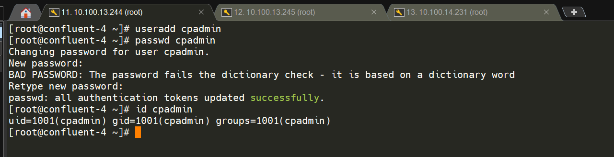
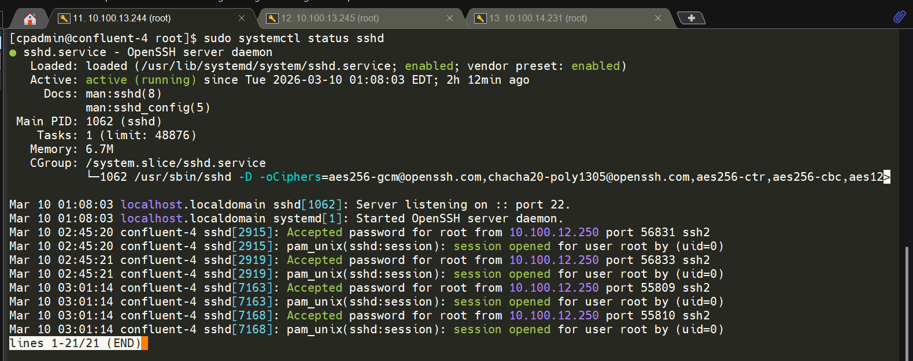
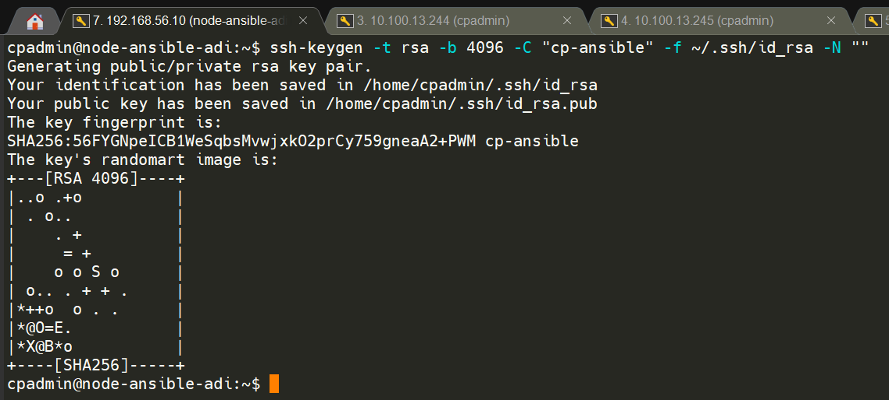
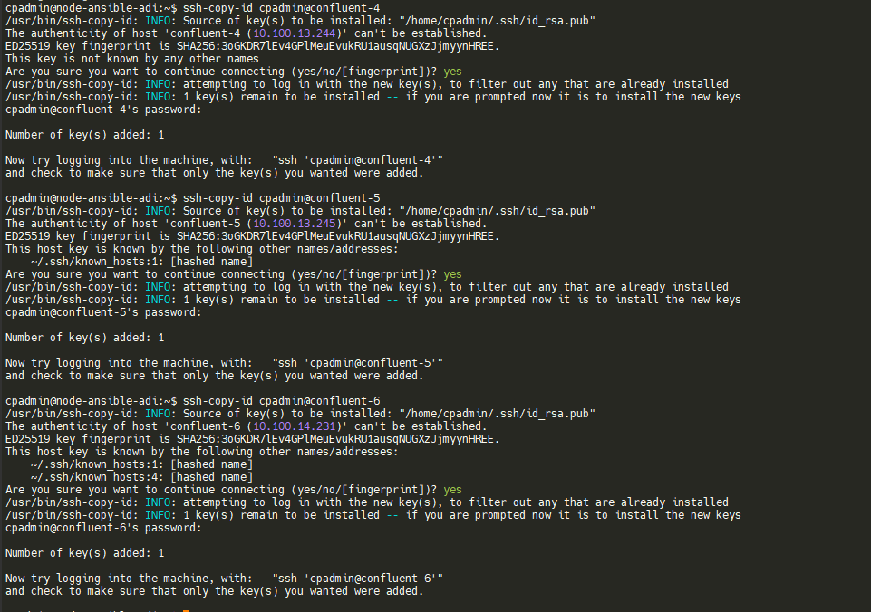
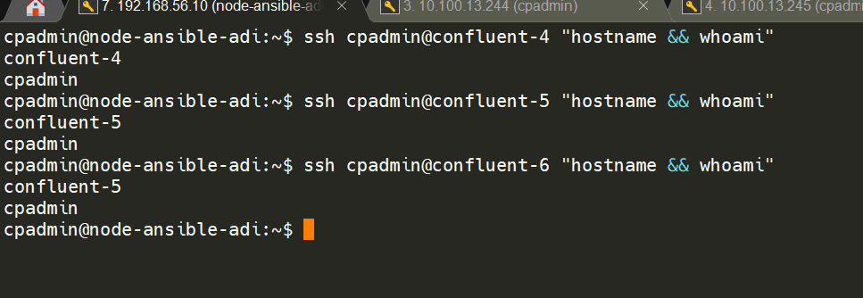
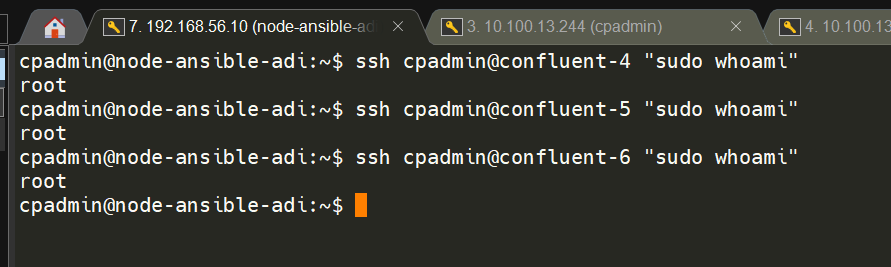
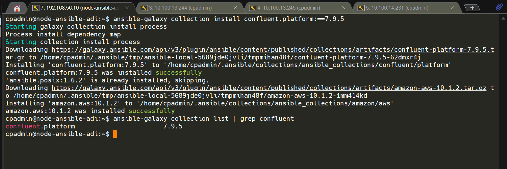
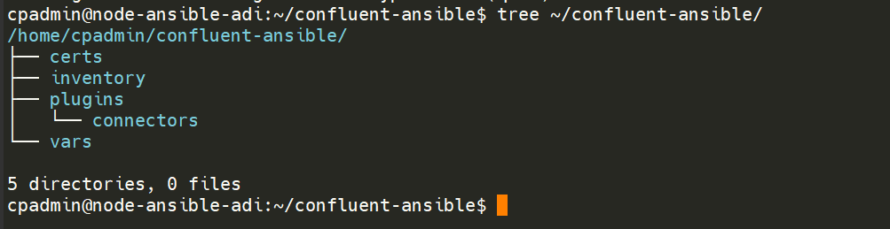

# list server adi 

terdapat 3 vm server adi yang diberikan yaitu
1. 10.100.13.244 - VM Confluent-4
2. 10.100.13.245 - VM Confluent-5
3. 10.100.14.231 - VM Confluent-6

# buat user baru untuk cp

```bash
useradd cpadmin

#berikan password baru
passwd cpadmin

#verifikasi
id cpadmin
```



**tambahkan user cpadmin agar bisa akses sudo**
```bash
usermod -aG wheel cpadmin

# verifikasi
groups cpadmin

# login ulang user
exit
su - cpadmin

# tes sudo
sudo systemctl status sshd
```



---

## Spesifikasi Server

| Node | Hostname | IP Address | Role | User |
|------|----------|------------|------|------|
| Ansible Control | confluent-4 | 10.100.13.244 | Ansible Controller | cpadmin |
| Node 1 | confluent-5 | 10.100.13.245 | Kafka Broker + ZooKeeper | cpadmin |
| Node 2 | confluent-6 | 10.100.14.231 | Kafka Broker + ZooKeeper | cpadmin |

## Versi yang Digunakan

Berdasarkan dokumentasi resmi Confluent Ansible 7.9:

| Komponen | Versi |
|----------|-------|
| Confluent Platform | 7.9.x |
| Confluent Ansible | 7.9.x |
| Ansible | 9.x (ansible-core 2.16) |
| Python | 3.10.x |
| OS (semua node) | Ubuntu 22.04 LTS |

---
# siapkan node ansible di vm lokal

## set network adapter

gunakan bridge adapter pada adapter 1 vm lokal agar bisa terhubung ke vm adi.
1. adapter 1 NAT
2. adapter 2 bridge

lalu setting file `00-installer-config.yaml` menjadi:
```bash
network:
  version: 2
  ethernets:
    enp0s3:
      dhcp4: true

    enp0s8:
      dhcp4: no
      addresses:
        - 192.168.56.10/24
```

## step: 1: Konfigurasi /etc/hosts (Semua Node)

```bash
sudo nano /etc/hosts
```

Tambahkan baris berikut:
```
192.168.56.10  node-ansible-adi
10.100.13.244  confluent-4
10.100.13.245  confluent-5
10.100.14.231  confluent-6
```

**pastikan bisa ping ke vm kantor adi**

# Step 2: Update Sistem (Semua Node)

```bash
sudo apt update && sudo apt upgrade -y
```

## Step 3: Set Locale — Wajib Persyaratan Confluent (Semua Node)

Confluent Ansible **mensyaratkan** locale `en_US.UTF-8`:

```bash
sudo locale-gen en_US.UTF-8
sudo update-locale LANG=en_US.UTF-8 LC_ALL=en_US.UTF-8
```

**di rethat linux**
```
sudo localectl set-locale LANG=en_US.UTF-8
```

Verifikasi (perlu logout/login ulang agar aktif):
```bash
logout
# login kembali, lalu:
locale | grep LANG
# Output: LANG=en_US.UTF-8 ✅
```

## Step 4: Verifikasi Sinkronisasi Waktu — Wajib Persyaratan Confluent (Semua Node)

Ubuntu 22.04 sudah menyertakan `systemd-timesyncd` secara default sehingga **tidak perlu install chrony**. Cukup verifikasi statusnya:

```bash
timedatectl status
```

Output yang diharapkan:
```
               Local time: Wed 2026-02-25 16:03:57 WIB
           Universal time: Wed 2026-02-25 09:03:57 UTC
                 RTC time: Wed 2026-02-25 09:03:39
                Time zone: Asia/Jakarta (WIB, +0700)
System clock synchronized: yes          ← harus YES ✅
              NTP service: active        ← harus active ✅
          RTC in local TZ: no
```

Jika `NTP service: inactive`, aktifkan dengan:
```bash
sudo systemctl enable systemd-timesyncd
sudo systemctl start systemd-timesyncd
sudo timedatectl set-ntp true

# Verifikasi ulang
timedatectl status
```

---

# Instalasi Ansible — Hanya di cp-ansible

> Seluruh langkah berikut **hanya dilakukan di `cp-ansible`**

## Step 5: Verifikasi Python 3.10

Ubuntu 22.04 sudah menyertakan Python 3.10 secara default:

```bash
python3 --version
# Output: Python 3.10.x ✅
```

## Step 6: Install pip

```bash
sudo apt install -y python3-pip

# Upgrade pip ke versi terbaru
python3 -m pip install --upgrade pip
```

## Step 7: Tambahkan PATH

Binary ansible akan terinstall di `~/.local/bin`. Tambahkan ke PATH agar bisa dipanggil langsung:

```bash
echo 'export PATH=$PATH:$HOME/.local/bin' >> ~/.bashrc
source ~/.bashrc
```

## Step 8: Install Ansible 9.x

```bash
# Install Ansible package (bukan ansible-core)
python3 -m pip install "ansible==9.*"
```

> **Mengapa Ansible package, bukan ansible-core?**
> Dokumentasi resmi Confluent merekomendasikan `ansible` package karena sudah menyertakan semua modules dan plugins yang dibutuhkan. `ansible-core` hanya berisi modul minimal dan memerlukan install modul tambahan secara manual.

## Step 9: Verifikasi Instalasi Ansible

```bash
ansible --version
```

Output yang diharapkan:
```
ansible [core 2.16.x]
  config file = None
  configured module search path = [...]
  executable location = /home/cpadmin/.local/bin/ansible
  python version = 3.10.x
  jinja version = 3.x.x
  libyaml = True
```

Pastikan:
- `ansible [core 2.16.x]` ✅
- `python version = 3.10.x` ✅

## Step 10: Install Dependencies Tambahan

```bash
pip3 install --user \
  requests \
  jmespath \
  netaddr
```

---
# Konfigurasi SSH Key — cp-ansible ke Semua Node

> Confluent Ansible berkomunikasi via SSH. Control node harus bisa SSH ke semua node **tanpa password**.

## Step 11: Generate SSH Key di cp-ansible

```bash
# Pastikan login sebagai cpadmin
whoami
# Output: cp-ansble

ssh-keygen -t rsa -b 4096 -C "cp-ansible" -f ~/.ssh/id_rsa -N ""
```


Output:
```
Generating public/private rsa key pair.
Your identification has been saved in /home/cpadmin/.ssh/id_rsa
Your public key has been saved in /home/cpadmin/.ssh/id_rsa.pub
```

## Step 12: Copy SSH Key ke Semua Node

```bash
ssh-copy-id cpadmin@10.100.13.244
ssh-copy-id cpadmin@10.100.13.245
ssh-copy-id cpadmin@10.100.14.231
```



Masukkan password masing-masing user di node saat diminta.

## Step 13: Verifikasi SSH Tanpa Password

```bash
ssh cpadmin@confluent-4 "hostname && whoami"
ssh cpadmin@confluent-5 "hostname && whoami"
ssh cpadmin@confluent-6 "hostname && whoami"
```



Output yang diharapkan:
```
confluent-4
cpadmin
```

## Step 14: Konfigurasi sudo Tanpa Password — Wajib untuk Ansible

Lakukan di **setiap node (confluent-4, confluent-5, confluent-6)**:

```bash
sudo visudo

# karena vm kantor menggunakan redhat(vim)
tekan i untuk edit
tekan esc
ketik :wq
```

Tambahkan baris berikut di **akhir file**:
```
# node 1
cpadmin ALL=(ALL) NOPASSWD: ALL

# node 2
cpadmin ALL=(ALL) NOPASSWD: ALL

# node 3
cpadmin ALL=(ALL) NOPASSWD: ALL
```

jika di ubuntu Simpan dengan `Ctrl+X → Y → Enter`.

**Verifikasi dari cp-ansible:**
```bash
ssh cpadmin@confluent-4 "sudo whoami"
# Output: root (tanpa diminta password) ✅

ssh cpadmin@confluent-5 "sudo whoami"
# Output: root ✅

ssh cpadmin@confluent-6 "sudo whoami"
# Output: root ✅
```


---

# Install Confluent Ansible Collection

## Step 15: Install via Ansible Galaxy

**lakukan di ansible node**

```bash
ansible-galaxy collection install confluent.platform:==7.9.5
```

Output yang diharapkan:
```
Starting galaxy collection install process
Process install dependency map
Starting collection install process
confluent.platform (7.9.5) was installed successfully
```

## Step 16: Verifikasi Collection

```bash
ansible-galaxy collection list | grep confluent
```



Output:
```
confluent.platform    7.9.5 ✅
```

---

# Buat Struktur Project

## Step 17: Buat Direktori Kerja

**lakukan di node ansible**

```bash
mkdir -p ~/confluent-ansible/{inventory,vars,certs,plugins/connectors}
cd ~/confluent-ansible
```


## Step 18: Buat File Inventory

```bash
cat > ~/confluent-ansible/inventory/hosts.yml << 'EOF'
---
all:
  vars:
    ansible_user: cpadmin
    ansible_become: true
    ansible_ssh_private_key_file: ~/.ssh/id_rsa

zookeeper:
  hosts:
    confluent-4:
      ansible_host: 10.100.13.244
    confluent-5:
      ansible_host: 10.100.13.245
    confluent-6:
      ansible_host: 10.100.14.231

kafka_broker:
  hosts:
    confluent-4:
      ansible_host: 10.100.13.244
    confluent-5:
      ansible_host: 10.100.13.245
    confluent-6:
      ansible_host: 10.100.14.231
EOF
```

---

# Verifikasi Akhir

## Step 19: Test Ansible Ping ke Semua Node

```bash
cd ~/confluent-ansible
ansible -i inventory/hosts.yml all -m ping
```


Output yang diharapkan:
```
cp-node1 | SUCCESS => {
    "ansible_facts": {
        "discovered_interpreter_python": "/usr/bin/python3"
    },
    "changed": false,
    "ping": "pong"
}
cp-node2 | SUCCESS => {
    "changed": false,
    "ping": "pong"
}
cp-node3 | SUCCESS => {
    "changed": false,
    "ping": "pong"
}
```


Semua node `SUCCESS` → ✅ **Task 1 Selesai!**

---