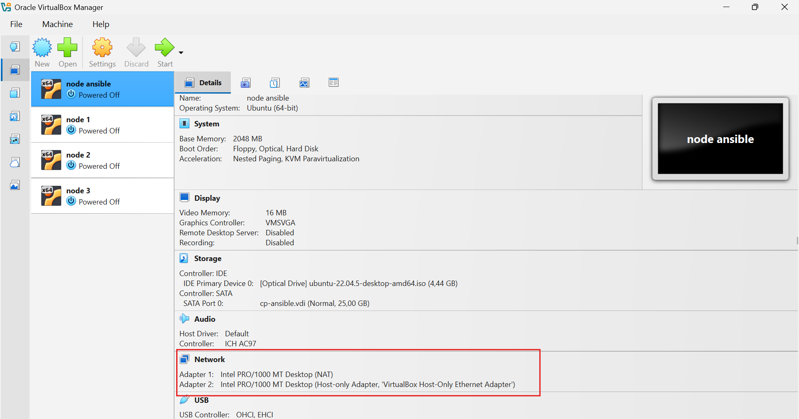
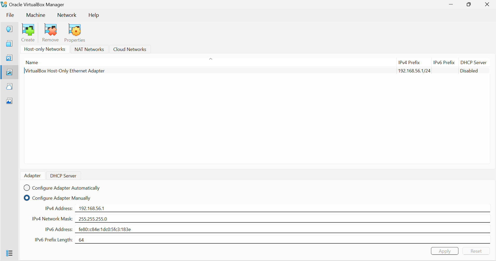
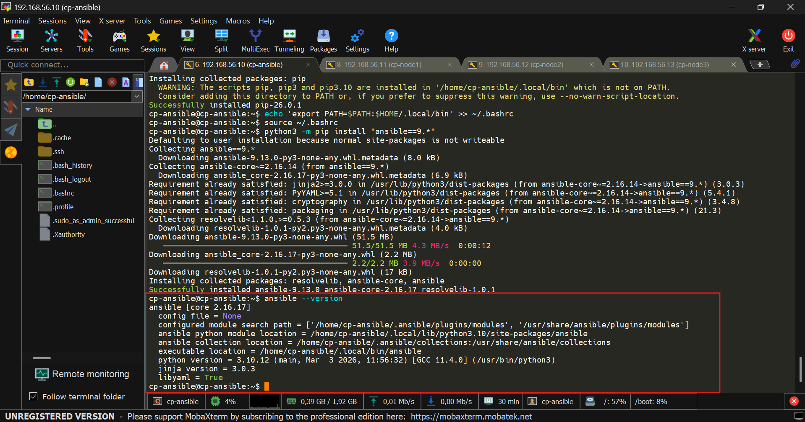
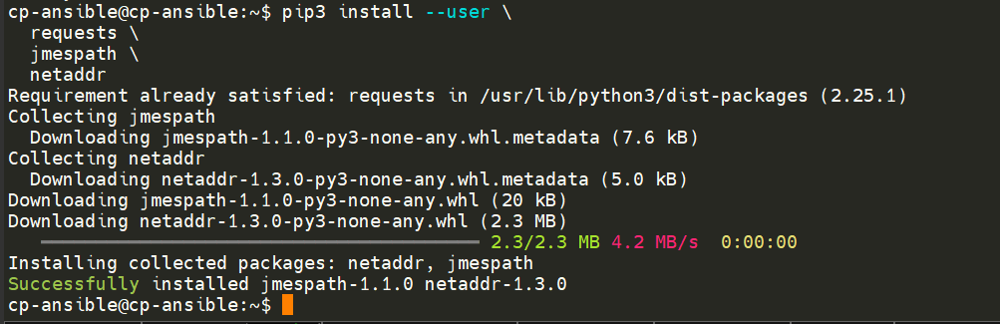
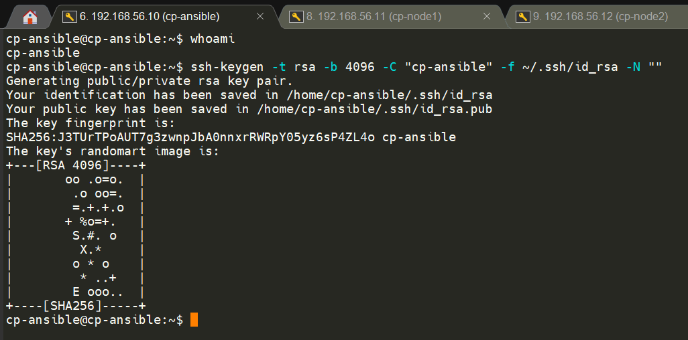
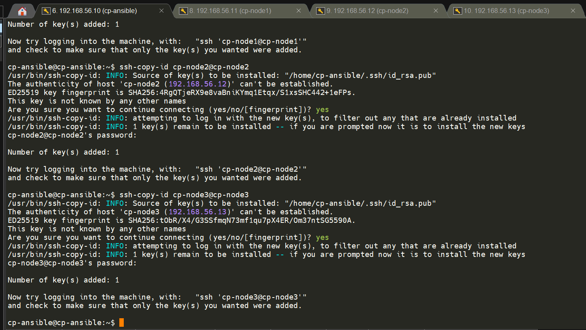
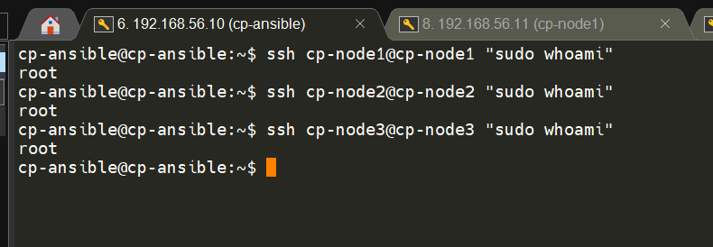
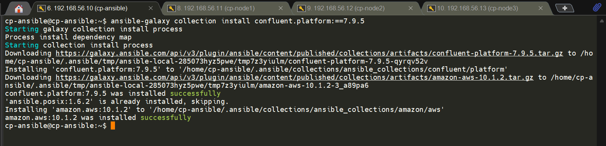
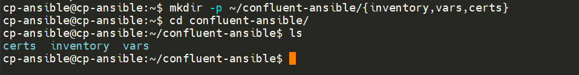
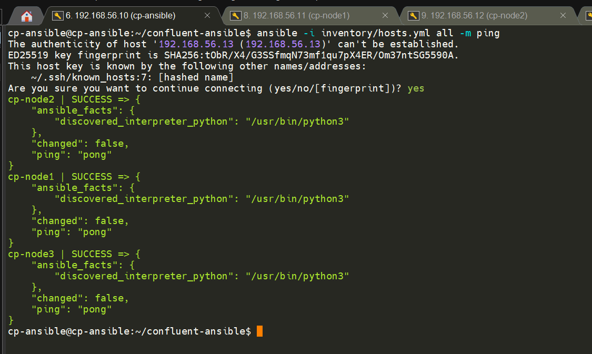

# Arsitektur Lab untuk ansible

```
┌─────────────────────────────────────────────────────────────────┐
│                        VirtualBox Host                          │
│                                                                 │
│  ┌──────────────────┐    ┌──────────────────────────────────┐  │
│  │  Ansible Control │    │         Cluster Nodes            │  │
│  │      Node        │    │                                  │  │
│  │                  │    │  ┌──────────┐  ┌──────────┐      │  │
│  │  cp-ansible      │SSH │  │ cp-node1 │  │ cp-node2 │      │  │
│  │  192.168.56.10   │───►│  │192.168.  │  │192.168.  │      │  │
│  │                  │    │  │56.11     │  │56.12     │      │  │
│  │  - Ansible 9.x   │    │  └──────────┘  └──────────┘      │  │
│  │  - Python 3.10   │    │                                  │  │
│  │  - cp-ansible    │    │  ┌──────────┐                    │  │
│  └──────────────────┘    │  │ cp-node3 │                    │  │
│                          │  │192.168.  │                    │  │
│                          │  │56.13     │                    │  │
│                          │  └──────────┘                    │  │
│                          └──────────────────────────────────┘  │
└─────────────────────────────────────────────────────────────────┘
```

berdasarkan arsitektur diatas maka akan dibuat 4 vm virtualbox dengan iso ubuntu v 24.02 dengan melakukan 2 setup adapter network pada semua vmnya. 

1. Adapter 1: NAT (untuk akses internet — install package)
2. Adapter 2: Host-Only Adapter (untuk komunikasi antar node)

## Spesifikasi Server

| Node | Hostname | IP Address | Role | User |
|------|----------|------------|------|------|
| Ansible Control | cp-ansible | 192.168.56.10 | Ansible Controller | cpadmin |
| Node 1 | cp-node1 | 192.168.56.11 | Kafka Broker + ZooKeeper | cpadmin |
| Node 2 | cp-node2 | 192.168.56.12 | Kafka Broker + ZooKeeper | cpadmin |
| Node 3 | cp-node3 | 192.168.56.13 | Kafka Broker + ZooKeeper | cpadmin |

> **Catatan:** Sesuaikan IP address dengan konfigurasi VirtualBox Host-Only Network Anda.

## Versi yang Digunakan

Berdasarkan dokumentasi resmi Confluent Ansible 7.9:

| Komponen | Versi |
|----------|-------|
| Confluent Platform | 7.9.x |
| Confluent Ansible | 7.9.x |
| Ansible | 9.x (ansible-core 2.16) |
| Python | 3.10.x |
| OS (semua node) | Ubuntu 22.04 LTS |


## Kredensial root node

| Komponen | hostname | Password |
|----------|-------| ------------|
| node ansible | cp-ansible | password |
| node 1 | cp-node1 | password |
| node 2 | cp-node2 | password |
| node 3 | cp-node3 | password |


---

# Persiapan Setup di Virtualbox

## Step 1: Installasi 4 vm dengan pengaturan 2 adapter network

Pastikan semua VM memiliki dua network adapter:

1. **Adapter 1:** NAT (untuk akses internet — install package)
2. **Adapter 2:** Host-Only Adapter (untuk komunikasi antar node)



**Cara Buat Host-Only Network di VirtualBox:**
```
VirtualBox Menu → File → Host Network Manager → Create
  IP Address  : 192.168.56.1
  Subnet Mask : 255.255.255.0
  DHCP Server : Disabled (agar IP statis)
```



## Step 2: Fix DNS — Wajib di Semua Node

> ⚠️ Jika VM pernah dibuat menggunakan jaringan kantor, DNS internal kantor ikut tersimpan dan menyebabkan gagal resolve domain saat berganti ke jaringan lain (hotspot, rumah, dsb).

Lakukan di **semua 4 node**:

```bash
# Edit konfigurasi systemd-resolved
sudo nano /etc/systemd/resolved.conf
```

Ubah bagian `[Resolve]` menjadi:
```ini
[Resolve]
DNS=8.8.8.8 8.8.4.4
FallbackDNS=1.1.1.1
DNSStubListener=yes
```

```bash
# Terapkan
sudo rm /etc/resolv.conf
sudo ln -sf /run/systemd/resolve/stub-resolv.conf /etc/resolv.conf
sudo systemctl restart systemd-resolved

# Verifikasi
ping -c 3 google.com
```

> **Aman di semua jaringan:** Saat pakai WiFi kantor, DNS kantor dari DHCP tetap jadi prioritas utama. Saat pakai hotspot/jaringan lain, otomatis fallback ke 8.8.8.8.

---

# Konfigurasi Semua Node (Lakukan di SEMUA 4 VM)

## Step 3: Set Hostname

**Di cp-ansible:**
```bash
sudo hostnamectl set-hostname cp-ansible
```

**Di cp-node1:**
```bash
sudo hostnamectl set-hostname cp-node1
```

**Di cp-node2:**
```bash
sudo hostnamectl set-hostname cp-node2
```

**Di cp-node3:**
```bash
sudo hostnamectl set-hostname cp-node3
```

**ganti username**
```bash
sudo usermod -l USER_BARU USER_LAMA
```


## Step 4: Konfigurasi IP Statis (Semua Node)

```bash
sudo nano /etc/netplan/00-installer-config.yaml
sudo chmod 600 /etc/netplan/00-installer-config.yaml
```

**Contoh untuk `cp-ansible` (192.168.56.10):**
```yaml
network:
  version: 2
  ethernets:
    enp0s3:          # Adapter 1 - NAT
      dhcp4: true
      nameservers:
        addresses: [8.8.8.8, 8.8.4.4]
        search: []
    enp0s8:          # Adapter 2 - Host-Only
      dhcp4: no
      addresses:
        - 192.168.56.10/24
```

> **Sesuaikan IP untuk setiap node:**
> - cp-node1: `192.168.56.11/24`
> - cp-node2: `192.168.56.12/24`
> - cp-node3: `192.168.56.13/24`

```bash
sudo netplan apply
sudo systemctl restart systemd-networkd
sudo reboot

# Verifikasi
ip addr show enp0s8
```

## Step 5: Konfigurasi /etc/hosts (Semua Node)

```bash
sudo nano /etc/hosts
```

Tambahkan baris berikut:
```
192.168.56.10   cp-ansible
192.168.56.11   cp-node1
192.168.56.12   cp-node2
192.168.56.13   cp-node3
```

## Step 6: Update Sistem (Semua Node)

```bash
sudo apt update && sudo apt upgrade -y
```

## Step 7: Set Locale — Wajib Persyaratan Confluent (Semua Node)

Confluent Ansible **mensyaratkan** locale `en_US.UTF-8`:

```bash
sudo locale-gen en_US.UTF-8
sudo update-locale LANG=en_US.UTF-8 LC_ALL=en_US.UTF-8
```

Verifikasi (perlu logout/login ulang agar aktif):
```bash
logout
# login kembali, lalu:
locale | grep LANG
# Output: LANG=en_US.UTF-8 ✅
```

## Step 8: Verifikasi Sinkronisasi Waktu — Wajib Persyaratan Confluent (Semua Node)

Ubuntu 22.04 sudah menyertakan `systemd-timesyncd` secara default sehingga **tidak perlu install chrony**. Cukup verifikasi statusnya:

```bash
timedatectl status
```

Output yang diharapkan:
```
               Local time: Wed 2026-02-25 16:03:57 WIB
           Universal time: Wed 2026-02-25 09:03:57 UTC
                 RTC time: Wed 2026-02-25 09:03:39
                Time zone: Asia/Jakarta (WIB, +0700)
System clock synchronized: yes          ← harus YES ✅
              NTP service: active        ← harus active ✅
          RTC in local TZ: no
```

Jika `NTP service: inactive`, aktifkan dengan:
```bash
sudo systemctl enable systemd-timesyncd
sudo systemctl start systemd-timesyncd
sudo timedatectl set-ntp true

# Verifikasi ulang
timedatectl status
```

---

# Instalasi Ansible — Hanya di cp-ansible

> Seluruh langkah berikut **hanya dilakukan di `cp-ansible`**

## Step 9: Verifikasi Python 3.10

Ubuntu 22.04 sudah menyertakan Python 3.10 secara default:

```bash
python3 --version
# Output: Python 3.10.x ✅
```

## Step 10: Install pip

```bash
sudo apt install -y python3-pip

# Upgrade pip ke versi terbaru
python3 -m pip install --upgrade pip
```

## Step 11: Tambahkan PATH

Binary ansible akan terinstall di `~/.local/bin`. Tambahkan ke PATH agar bisa dipanggil langsung:

```bash
echo 'export PATH=$PATH:$HOME/.local/bin' >> ~/.bashrc
source ~/.bashrc
```

## Step 12: Install Ansible 9.x

```bash
# Install Ansible package (bukan ansible-core)
python3 -m pip install "ansible==9.*"
```

> **Mengapa Ansible package, bukan ansible-core?**
> Dokumentasi resmi Confluent merekomendasikan `ansible` package karena sudah menyertakan semua modules dan plugins yang dibutuhkan. `ansible-core` hanya berisi modul minimal dan memerlukan install modul tambahan secara manual.

## Step 13: Verifikasi Instalasi Ansible

```bash
ansible --version
```



Output yang diharapkan:
```
ansible [core 2.16.x]
  config file = None
  configured module search path = [...]
  executable location = /home/cpadmin/.local/bin/ansible
  python version = 3.10.x
  jinja version = 3.x.x
  libyaml = True
```

Pastikan:
- `ansible [core 2.16.x]` ✅
- `python version = 3.10.x` ✅

## Step 14: Install Dependencies Tambahan

```bash
pip3 install --user \
  requests \
  jmespath \
  netaddr
```


---

# Konfigurasi SSH Key — cp-ansible ke Semua Node

> Confluent Ansible berkomunikasi via SSH. Control node harus bisa SSH ke semua node **tanpa password**.

## Step 15: Generate SSH Key di cp-ansible

```bash
# Pastikan login sebagai cpadmin
whoami
# Output: cp-ansble

ssh-keygen -t rsa -b 4096 -C "cp-ansible" -f ~/.ssh/id_rsa -N ""
```



Output:
```
Generating public/private rsa key pair.
Your identification has been saved in /home/cpadmin/.ssh/id_rsa
Your public key has been saved in /home/cpadmin/.ssh/id_rsa.pub
```

## Step 16: Copy SSH Key ke Semua Node

```bash
ssh-copy-id cp-node1@cp-node1
ssh-copy-id cp-node2@cp-node2
ssh-copy-id cp-node3@cp-node3
```



Masukkan password masing-masing user di node saat diminta.

## Step 17: Verifikasi SSH Tanpa Password

```bash
ssh cp-node1@cp-node1 "hostname && whoami"
ssh cp-node2@cp-node2 "hostname && whoami"
ssh cp-node3@cp-node3 "hostname && whoami"
```


Output yang diharapkan:
```
cp-node1
cp-node1
```

## Step 18: Konfigurasi sudo Tanpa Password — Wajib untuk Ansible

Lakukan di **setiap node (cp-node1, cp-node2, cp-node3)**:

```bash
sudo visudo
```

Tambahkan baris berikut di **akhir file**:
```
# ansible
cp-ansible ALL=(ALL) NOPASSWD: ALL

# node 1
cp-node1 ALL=(ALL) NOPASSWD: ALL

# node 2
cp-node2 ALL=(ALL) NOPASSWD: ALL

# node 3
cp-node3 ALL=(ALL) NOPASSWD: ALL
```

Simpan dengan `Ctrl+X → Y → Enter`.

**Verifikasi dari cp-ansible:**
```bash
ssh cpadmin@cp-node1 "sudo whoami"
# Output: root (tanpa diminta password) ✅

ssh cpadmin@cp-node2 "sudo whoami"
# Output: root ✅

ssh cpadmin@cp-node3 "sudo whoami"
# Output: root ✅
```



---
# Install Confluent Ansible Collection

## Step 19: Install via Ansible Galaxy

**lakukan di ansible node**

```bash
ansible-galaxy collection install confluent.platform:==7.9.5
```

Output yang diharapkan:
```
Starting galaxy collection install process
Process install dependency map
Starting collection install process
confluent.platform (7.9.5) was installed successfully
```



## Step 20: Verifikasi Collection

```bash
ansible-galaxy collection list | grep confluent
```

Output:
```
confluent.platform    7.9.5 ✅
```

---

# Buat Struktur Project

## Step 21: Buat Direktori Kerja

**lakukan di node ansible**

```bash
mkdir -p ~/confluent-ansible/{inventory,vars,certs}
cd ~/confluent-ansible
```



## Step 22: Buat File Inventory

```bash
cat > ~/confluent-ansible/inventory/hosts.yml << 'EOF'
---
all:
  vars:
    ansible_become: true
    ansible_ssh_private_key_file: ~/.ssh/id_rsa

zookeeper:
  hosts:
    cp-node1:
      ansible_host: 192.168.56.11
      ansible_user: cp-node1
    cp-node2:
      ansible_host: 192.168.56.12
      ansible_user: cp-node2
    cp-node3:
      ansible_host: 192.168.56.13
      ansible_user: cp-node3

kafka_broker:
  hosts:
    cp-node1:
      ansible_host: 192.168.56.11
      ansible_user: cp-node1
    cp-node2:
      ansible_host: 192.168.56.12
      ansible_user: cp-node2
    cp-node3:
      ansible_host: 192.168.56.13
      ansible_user: cp-node3
EOF
```

---

# Verifikasi Akhir

## Step 23: Test Ansible Ping ke Semua Node

```bash
cd ~/confluent-ansible
ansible -i inventory/hosts.yml all -m ping
```


Output yang diharapkan:
```
cp-node1 | SUCCESS => {
    "ansible_facts": {
        "discovered_interpreter_python": "/usr/bin/python3"
    },
    "changed": false,
    "ping": "pong"
}
cp-node2 | SUCCESS => {
    "changed": false,
    "ping": "pong"
}
cp-node3 | SUCCESS => {
    "changed": false,
    "ping": "pong"
}
```

Semua node `SUCCESS` → ✅ **Task 1 Selesai!**

---