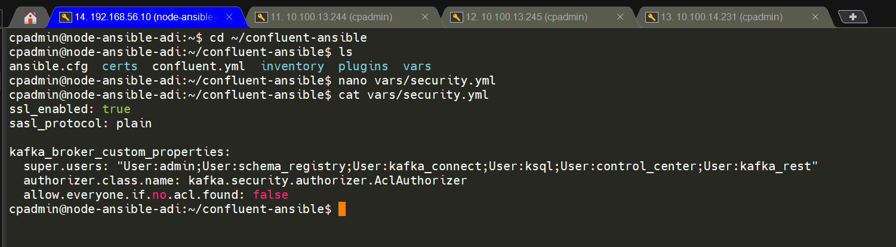
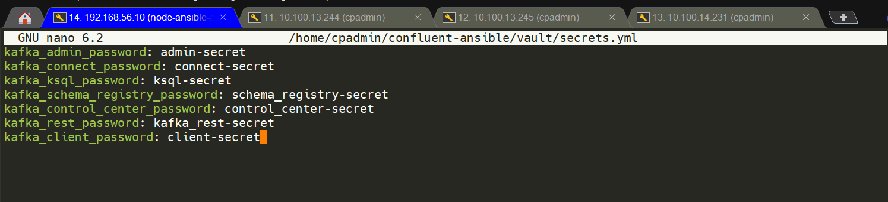
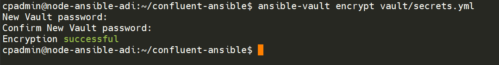
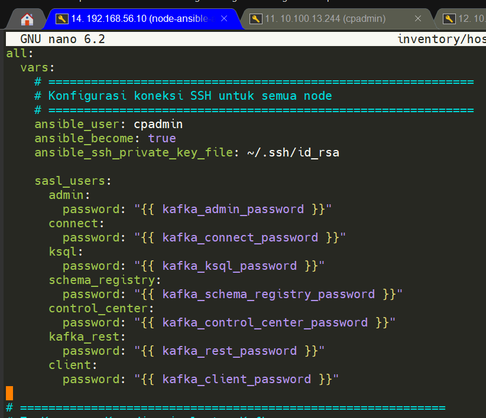
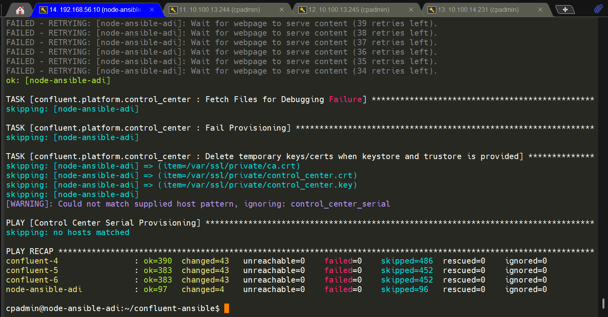

# Setup server

server vm adi terdiri dari 3 vm yaitu
- 10.100.13.244  Confluent-4
- 10.100.13.245  Confluent-5
- 10.100.14.231  Confluent-6

--- 

# Security Model

## 1. Encryption (TLS)

Semua komunikasi dienkripsi menggunakan **TLS certificate** yang di-generate otomatis oleh CP Ansible:

```
Broker ↔ Broker
Broker ↔ ZooKeeper
Client ↔ Broker
Component ↔ Component
```

> **Penting:** Jangan generate certificate manual dengan OpenSSL dan meletakkannya di `vars/security.yml` menggunakan `ssl_keystore_path` dll. CP Ansible akan otomatis generate certificate dengan CN dan SAN yang benar untuk setiap node. Certificate manual yang di-generate dengan `CN=localhost` akan menyebabkan TLS handshake gagal karena hostname tidak cocok.

## 2. Authentication

Kafka menggunakan **SASL/PLAIN**. User harus login sebelum mengakses broker.

Daftar user yang digunakan:

| User | Fungsi |
|---|---|
| `admin` | Inter-broker communication, admin tasks |
| `schema_registry` | Schema Registry → Broker |
| `kafka_connect` | Kafka Connect → Broker |
| `ksql` | ksqlDB → Broker |
| `control_center` | Control Center → Broker |
| `kafka_rest` | REST Proxy → Broker |
| `client` | External client (producer/consumer) |

## 3. Authorization

Kafka menggunakan **ACL (Access Control List)** dengan `AclAuthorizer`. Semua akses ditolak kecuali ada ACL eksplisit (`allow.everyone.if.no.acl.found: false`).

Service account internal didaftarkan sebagai **super.users** agar bisa bypass ACL check untuk komunikasi internal antar komponen:

```
super.users=User:admin;User:schema_registry;User:kafka_connect;User:ksql;User:control_center;User:kafka_rest
```

## 4. Secret Protection

Semua password disimpan menggunakan **Ansible Vault** sehingga tidak muncul plaintext di inventory atau version control.

---

# Struktur Direktori Project

```
~/confluent-ansible/
├── confluent.yml
├── inventory/
│   └── hosts.yml
├── vars/
│   ├── platform.yml
│   └── security.yml
└── vault/
    └── secrets.yml
```

> **Catatan:** Folder `certs/` dari instruksi awal tidak diperlukan karena CP Ansible generate certificate otomatis.

---

## Step 1: Buat File `vars/security.yml`

Buat file konfigurasi security. **Biarkan CP Ansible yang generate certificate** — jangan override dengan custom cert path.

```bash
nano ~/confluent-ansible/vars/security.yml
```

```yaml
---
ssl_enabled: true
sasl_protocol: plain
self_signed: true

kafka_broker_custom_properties:
  super.users: "User:admin;User:schema_registry;User:kafka_connect;User:ksql;User:control_center;User:kafka_rest"
  authorizer.class.name: kafka.security.authorizer.AclAuthorizer
  allow.everyone.if.no.acl.found: false
```



> **Penjelasan `super.users`:** Diperlukan agar service internal (Schema Registry, Connect, ksqlDB, dll) bisa berkomunikasi dengan broker tanpa perlu ACL satu per satu. Tanpa ini, semua service akan mendapat `TopicAuthorizationException` saat startup.

---

## Step 2: Update `vars/platform.yml`

Pastikan tidak ada konflik dengan `security.yml`. Hapus atau comment baris berikut jika ada:

```yaml
# HAPUS atau comment kedua baris ini dari platform.yml:
# ssl_enabled: false
# sasl_protocol: none
```

Karena TLS sudah aktif, update semua URL Schema Registry dari HTTP ke HTTPS:

```yaml
# ksqlDB
ksql_custom_properties:
  ksql.schema.registry.url: "https://cp-node1:8081"

# REST Proxy
kafka_rest_custom_properties:
  schema.registry.url: "https://cp-node1:8081"

# Schema Registry
schema_registry_custom_properties:
  listeners: "https://0.0.0.0:8081"
```

---

## Step 3: Buat File Secrets dengan Ansible Vault

### Buat `vault/secrets.yml`

```bash
mkdir -p ~/confluent-ansible/vault
nano ~/confluent-ansible/vault/secrets.yml
```

```yaml
kafka_admin_password: admin-secret
kafka_connect_password: connect-secret
kafka_ksql_password: ksql-secret
kafka_schema_registry_password: schema_registry-secret
kafka_control_center_password: control_center-secret
kafka_rest_password: kafka_rest-secret
kafka_client_password: client-secret
```



### Encrypt dengan Ansible Vault

```bash
ansible-vault encrypt vault/secrets.yml
```

Masukkan vault password saat diminta. Contoh: `password`



Verifikasi file sudah terenkripsi:

```bash
cat vault/secrets.yml
# Output harus berupa: $ANSIBLE_VAULT;1.1;AES256...
```

Untuk edit kembali:

```bash
ansible-vault edit vault/secrets.yml
```

---

## Step 4: Update `inventory/hosts.yml`

Tambahkan `sasl_users` untuk semua service account. Password mengacu ke variabel dari vault.

```yaml
all:
  vars:
    ansible_user: cpadmin
    ansible_become: true
    ansible_ssh_private_key_file: ~/.ssh/id_rsa

    sasl_users:
      admin:
        password: "{{ kafka_admin_password }}"
      connect:
        password: "{{ kafka_connect_password }}"
      ksql:
        password: "{{ kafka_ksql_password }}"
      schema_registry:
        password: "{{ kafka_schema_registry_password }}"
      control_center:
        password: "{{ kafka_control_center_password }}"
      kafka_rest:
        password: "{{ kafka_rest_password }}"
      client:
        password: "{{ kafka_client_password }}"

zookeeper:
  hosts:
    cp-node1:
      ansible_host: 192.168.56.11
    cp-node2:
      ansible_host: 192.168.56.12
    cp-node3:
      ansible_host: 192.168.56.13

kafka_broker:
  hosts:
    cp-node1:
      ansible_host: 192.168.56.11
    cp-node2:
      ansible_host: 192.168.56.12
    cp-node3:
      ansible_host: 192.168.56.13

schema_registry:
  hosts:
    cp-node1:
      ansible_host: 192.168.56.11
    cp-node2:
      ansible_host: 192.168.56.12
    cp-node3:
      ansible_host: 192.168.56.13

kafka_connect:
  hosts:
    cp-node1:
      ansible_host: 192.168.56.11
    cp-node2:
      ansible_host: 192.168.56.12
    cp-node3:
      ansible_host: 192.168.56.13

ksql:
  hosts:
    cp-node1:
      ansible_host: 192.168.56.11
    cp-node2:
      ansible_host: 192.168.56.12
    cp-node3:
      ansible_host: 192.168.56.13

kafka_rest:
  hosts:
    cp-node1:
      ansible_host: 192.168.56.11
    cp-node2:
      ansible_host: 192.168.56.12
    cp-node3:
      ansible_host: 192.168.56.13

control_center:
  hosts:
    cp-ansible:
      ansible_host: 192.168.56.10
```



---

## Step 5: Update `confluent.yml`

Pastikan semua variable file di-load di awal playbook, termasuk vault:

```yaml
- name: Load variables
  hosts: all
  tasks:
    - include_vars: vars/platform.yml
    - include_vars: vars/security.yml
    - include_vars: vault/secrets.yml
```

---

## Step 6: Sinkronisasi Waktu (Penting!)

Sebelum deploy, pastikan waktu sistem di semua node sinkron. Waktu yang tidak akurat akan menyebabkan `apt` gagal update karena repository timestamp dianggap invalid.

```bash
# Install dan aktifkan chrony
sudo apt install chrony -y
sudo systemctl enable chrony
sudo systemctl start chrony

# Paksa sync sekarang
sudo chronyc makestep

# Verifikasi
chronyc tracking
# Reference ID harus terisi (bukan 0.0.0.0)
```

**untuk rocky linux**
```bash
# Install chrony
sudo yum install chrony -y
# atau jika CentOS 8 / Rocky / Alma gunakan dnf
# sudo dnf install chrony -y

# Aktifkan service saat boot
sudo systemctl enable chronyd

# Jalankan service
sudo systemctl start chronyd

# Paksa sinkronisasi waktu sekarang
sudo chronyc makestep

# Verifikasi status sinkronisasi
chronyc tracking

# Optional: cek sumber NTP yang dipakai
chronyc sources -v
```


### 7. Generate SSL folder manual

penyebab harus buat manual adalah Karena collection Confluent Platform yang kamu pakai tidak include playbook generate_ssl_files.

```bash
cd ~/confluent-ansible

# Buat folder output
mkdir -p generated_ssl_files

# Generate CA key + cert
openssl req -new -x509 -keyout generated_ssl_files/snakeoil-ca-1.key \
  -out generated_ssl_files/snakeoil-ca-1.crt \
  -days 365 -nodes \
  -subj "/C=ID/ST=Jakarta/L=Jakarta/O=ADI-Lab/CN=snakeoil-ca"
```

---

## Step 8: Jalankan Deployment Secure Cluster

```bash
cd ~/confluent-ansible

ansible-playbook \
  -i inventory/hosts.yml \
  confluent.yml \
  --ask-vault-pass
```
```bash
cd ~/confluent-ansible
ansible-playbook -i inventory/hosts.yml confluent.yml \
  -e @vars/platform.yml \
  -e @vars/security.yml \
  --vault-password-file vault/vault-password.txt 2>&1 | tee ansible-run.log
```


Masukkan vault password saat diminta.

### Estimasi Waktu

| Skenario | Estimasi |
|---|---|
| Full deploy pertama kali | 45-60 menit |
| Re-deploy (node sudah terinstall) | 20-30 menit |
| Deploy hanya Control Center | 5-10 menit |

Untuk deploy hanya komponen tertentu:

```bash
# Hanya Control Center
ansible-playbook \
  -i inventory/hosts.yml \
  confluent.yml \
  --ask-vault-pass \
  --limit control_center
```


### Service Yang Akan Restart

Saat security diaktifkan, semua service akan restart secara berurutan:

```
ZooKeeper → Kafka Broker → Schema Registry → 
Kafka Connect → ksqlDB → REST Proxy → Control Center
```

---

## Hasil dari 




----

# troubleshoot

## TASK [confluent.platform.ssl : Copy CA Cert to Host] ***************************

```bash
# Copy cert ke semua path yang dicari collection
mkdir -p ~/.ansible/collections/ansible_collections/confluent/platform/playbooks/generated_ssl_files

cp ~/confluent-ansible/generated_ssl_files/snakeoil-ca-1.crt \
   ~/.ansible/collections/ansible_collections/confluent/platform/playbooks/generated_ssl_files/

cp ~/confluent-ansible/generated_ssl_files/snakeoil-ca-1.key \
   ~/.ansible/collections/ansible_collections/confluent/platform/playbooks/generated_ssl_files/

# Verifikasi
ls -la ~/.ansible/collections/ansible_collections/confluent/platform/playbooks/generated_ssl_files/
```